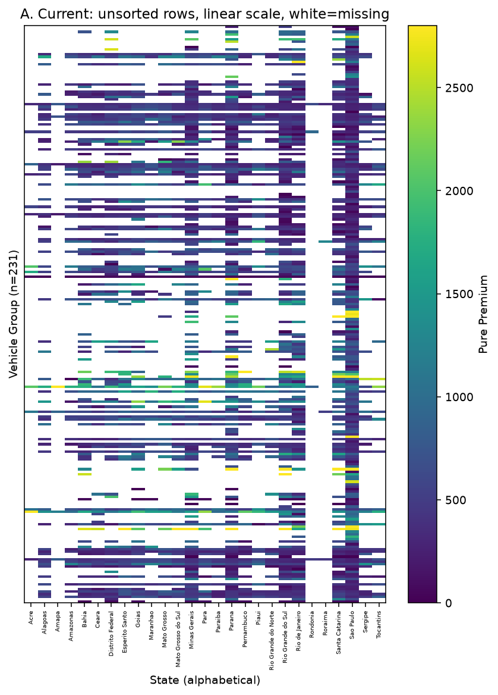
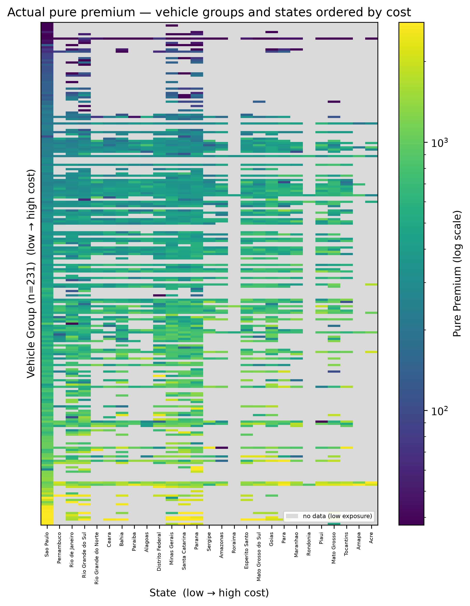
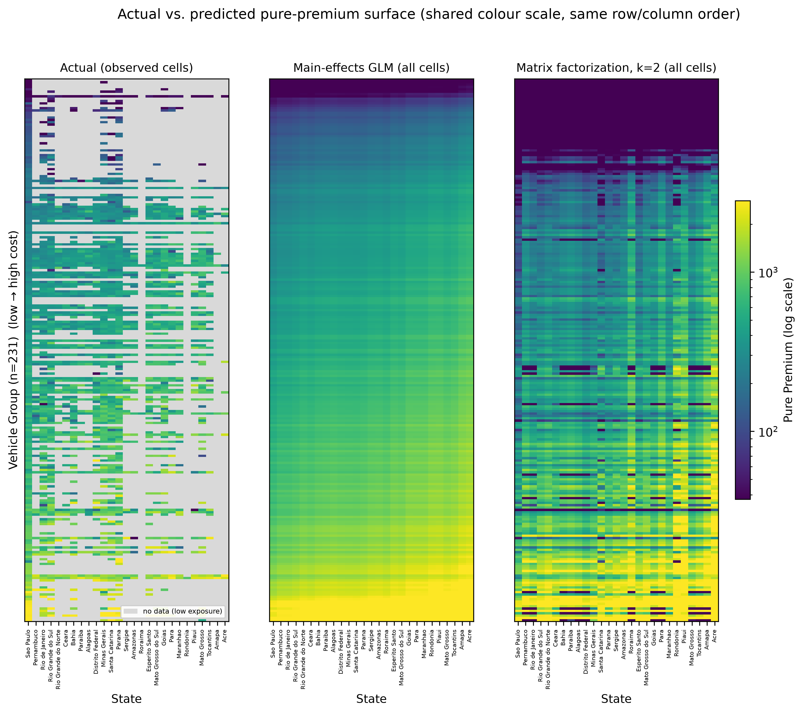
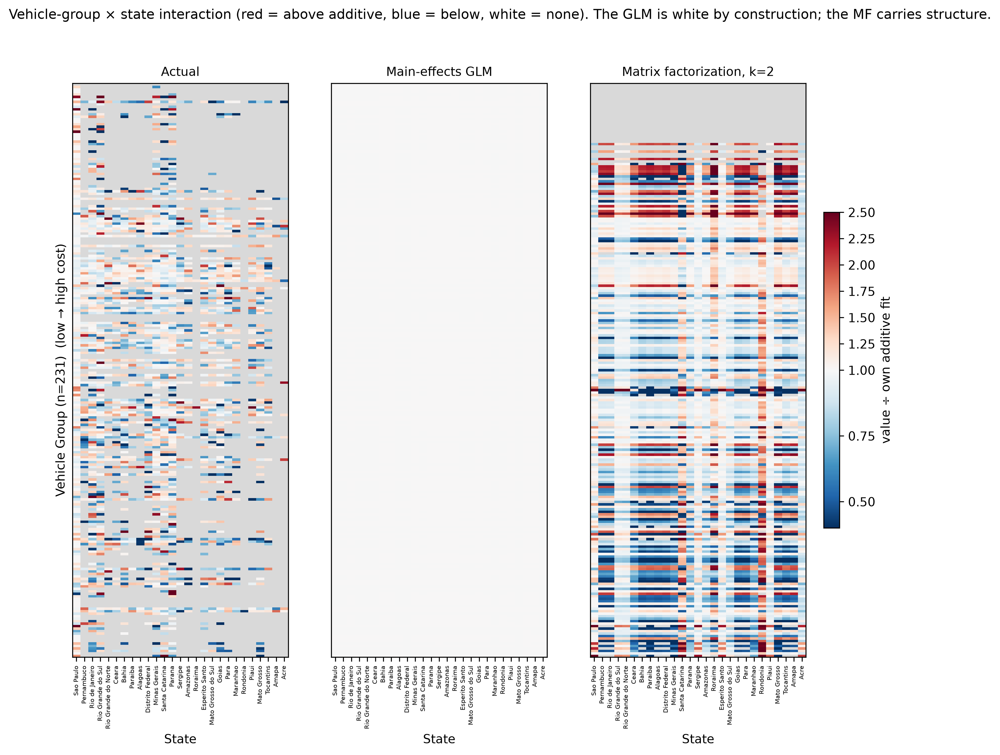
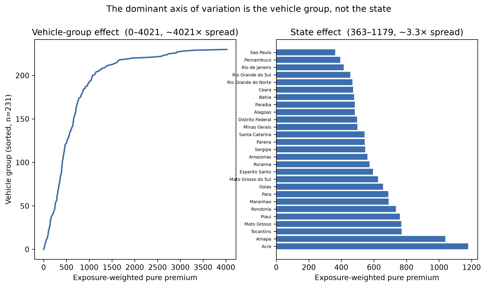
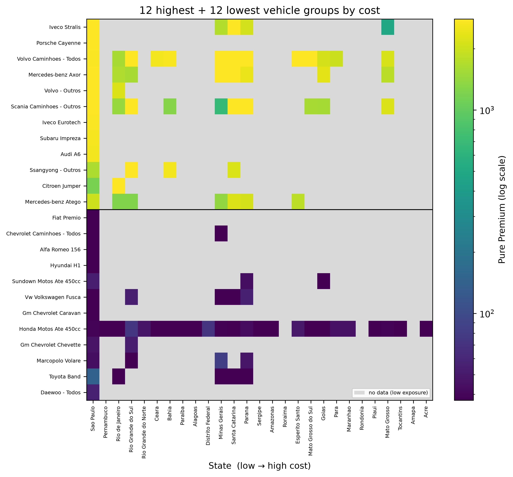

# ヒートマップの代替可視化案

現行の 231×27（VehGroup × State）ヒートマップ（`figs/python_port/heatmap_actual.png`
など、論文 Fig 4.2.1 / 4.3.x / 4.5.2）が「見づらい」問題に対する代替案の比較。
実データ（mainline の 231×27 行列、観測 2,233 セル）で生成。
GLMM は省略（PyMC サンプリングが重く、論文どおり未観測交互作用セルでは GLM に一致するため）。

**本番版（推奨案の仕上げ）**
生成スクリプト: `src/paper_heatmaps_v2.py`（`python src/paper_heatmaps_v2.py` で再生成）
出力: `figs/paper_v2/`（B・C・D・E・F）。プロトタイプの2点（MFの対数床アーティファクト、
Dの中心化）は修正済み。

参考（初期プロトタイプ）: `scratchpad/heatmap_alternatives.py` → `figs/heatmap_alternatives/`

---

## なぜ現行版は読みにくいか（重要度順）

1. **231 行が任意の順序** — これが最大の問題。論文の主張（コストの支配軸は
   車両グループで ~4000 倍の開き、州は ~3 倍）が、行が並び替えられていないため
   まったく見えない。ノイズにしか見えない。
2. **州が ABC 順** — コスト勾配（São Paulo 最低 → 北部州が最高）が崩れている。
3. **線形カラー + 右裾の重い分布 + 高い vmax** — 中央値 500 に対しスケールは
   ~2800 まで伸びるので、大半のセルが viridis の暗部に潰れる。
4. **白 = 欠測** — viridis の明部（黄色）と紛らわしく、「高い」のか「無い」のか曖昧。
   欠測は情報を持つ（低エクスポージャ）ので、カラーランプの外の扱いにすべき。
5. **actual と各モデルが別ページ・別スケール** — 論文の肝である実測 vs 予測の
   比較が目視でできない。

---

## 案A（現行スタイル・参照用）

未ソート・線形・白=欠測。上記 1〜5 の問題がそのまま。

---

## 案B（Tier 1）両軸ソート + 対数カラー + 欠測はグレー

- 行を車両グループの周辺平均、列を州の周辺平均でソート → 勾配が一目瞭然。
- 対数カラーで中央域の差が見える。
- 欠測を明示的にグレー（+凡例）でランプ外に。
- **論文の主張を変えず、労力最小で最大の可読性改善。まず入れるべき土台。**

---

## 案C（Tier 1）共有スケールのスモールマルチプル（実測 | GLM | MF）

- 3 枚を同じ行/列順・**1 本のカラーバー**で横並び。セル単位で直接比較可能。
- GLM が「完全に滑らかな縦勾配（＝比例的・交互作用なし）」、MF が「テクスチャあり
  （＝交互作用を捕捉）」、実測が「疎」であることが視覚的に即わかる。
- **論文の実測 vs モデル比較を、いまの別ページ構成より圧倒的に強く伝える。推奨。**
- 本番版では下限クリップで対数床アーティファクトを解消済み。

---

## 案D（Tier 2）交互作用マップ（加法フィットとの比・発散カラー）

- 「MF は加法 GLM が捉えられない VehGroup×State 交互作用を捉える」という論文の
  科学的主張を、**図そのもの**にするアプローチ。赤=加法予測より上、青=下、白=交互作用なし。
- 論文自身の但し書き（「見た目が派手＝正確とは限らない」）に正面から答えられる。
- **本番版で修正済み**: 各サーフェスを**それぞれ自身の加法フィット（行+列, 対数空間）で
  中心化**（1 中心）。結果、**GLM パネルは構成上ほぼ完全な白**（対数リンク主効果GLMは
  対数空間で加法的＝交互作用ゼロ）、実測は疎でノイジーな交互作用、MF は明確な構造を持つ、
  という3枚の対比になる。GLMが「証明として白」になる点が最も強い。

---

## 案E（Tier 3）ソート済み周辺効果プロット（ヒートマップを使わない）

- 論文の中心的な実証結果（車両グループ ~4021 倍 vs 州 ~3.3 倍）を 1 枚で明快に。
- 1 次元の話は巨大ヒートマップより折れ線+棒の方が正確に伝わる。
- **最も単純かつ強力な伝達。本文に置き、フル行列は付録に回す構成が有効。**

---

## 案F（Tier 3）ラベル付き部分行列（上位12 + 下位12 車両グループ）

- 行が読める。本文が名指しするグループ（Iveco Stralis / Volvo / Scania の大型トラック
  が上位、Honda/Suzuki の小型二輪・VW Fusca が下位）を実際に位置特定できる。
- フル 231 行は付録、本文はこの可読サブセット、という役割分担に向く。

---

## 推奨

- **土台（すぐ入れる）**: 案B + 案C。両軸ソート・対数カラー・欠測グレー・共有スケールの
  スモールマルチプルは、論文の主張を変えずに可読性を最大改善する。
- **主張を強める**: 案E を本文の主役に（4000×対3×）、フル行列は付録へ。
- **さらに一段**: 案D（各サーフェスを自己中心化した交互作用マップ）で「MF が交互作用を
  捕捉」を厳密に可視化。要実装改良。
- 案F は本文用の「読めるヒートマップ」として案E/Cを補完。

どれを本番の図（`generate_paper_figures` / `visualize_heatmap`）に落とし込むか決めれば、
その方向で実装する。
