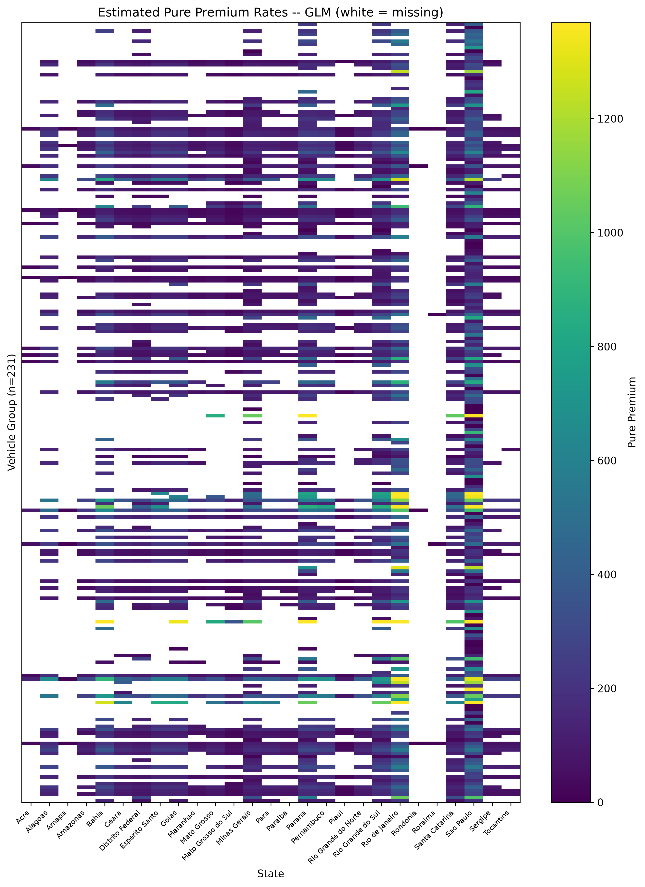
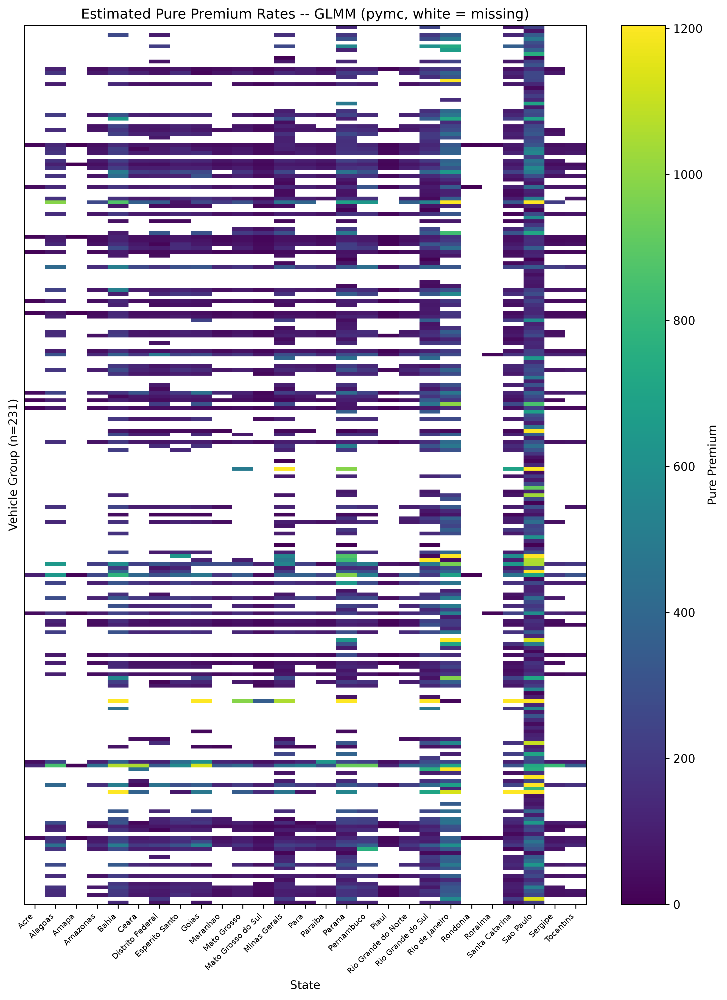

**Matrix Factorization for Modeling High-Dimensional Interactions in Class Ratemaking — Application to Vehicle Theft**

*Prepared by **Nana Kato, Suguru Fujita, Shunichi Nomura*

Presented to the 

33rd International Congress of Actuaries (ICA2026)

November 8th – 13th, 2026

*This paper has been prepared for the **33rd **International Congress of Actuaries.*

*The **Institute of **Actuaries** of** **Japa**n **(IAJ) and **the **International Actuarial Association (IAA) **assume no responsibility for opinions or content expressed in this paper or in the **accompanying** materials. Furthermore, the opinions and content contained herein do not reflect the views of the **IAJ or the IAA**.*

 Nana Kato, Suguru Fujita, and Shunichi Nomura

The IAJ and the IAA will ensure that all reproductions of the paper acknowledge the author(s) and include the above copyright statement.

## Abstract (accepted)

**Main Subject**: Non-Life Insurance
**Sub Subject**: Data Science/AI
**Keyword 01**: Matrix Factorization
**Keyword 02**: Class Rate-Making
**Keyword 03**: Interaction

This study introduces matrix factorization, a technique widely used in recommender systems, as a novel approach to insurance class rate-making. We address a critical challenge in actuarial science to handle the high dimensionality of categorical variables and their interactions, such as regions and car models. Although these variables often exhibit complex interactions, modern insurance portfolios typically suffer from sparse claim experience. While traditional statistical models have struggled to handle such high-dimensional interactions, our matrix factorization approach efficiently estimates them through a product of latent factors, which substantially reduces the number of parameters. Furthermore, our approach provides a simple and straightforward representation of the interactions, which is essential for accountability in setting pure premiums but is often overlooked in other machine learning methods. To demonstrate its performance, a comparative analysis was conducted using a real-world auto insurance dataset containing very high-dimensional variables, applied here to the **vehicle-theft (robbery) peril**, whose pure premium exhibits a substantially stronger vehicle × region interaction than collision. Our proposed model was implemented and optimized using cmfrec, a R/Python library for stable matrix factorization, with the number of latent factors and the regularization weight determined via cross-validation. The performance of our model was then benchmarked against a standard Generalized Linear Model (GLM) and a Generalized Linear Mixed Model (GLMM), both of which are common in actuarial practice. The results showed that matrix factorization captured this interaction with a high-rank factorization and was the most accurate model on unweighted RMSE; more importantly, in the sparse exposure segment—the regime this method targets—it outperformed the main-effects GLM on both exposure-weighted RMSE and Poisson deviance, while the GLM remained competitive in the data-rich (dense) segment that dominates the pooled metric. This research validates that matrix factorization provides a powerful alternative for actuaries in exactly the sparse, high-interaction settings where conventional models struggle.

# Introduction

In the calculation of insurance premium rates, determining class rates often presents challenges when dealing with variables containing a large number of categories or missing data. For instance, in automobile insurance tariffs, variables with numerous categories—such as geographic region or vehicle manufacturer—are frequently employed, and interactions between these and other variables are often incorporated into the models.

   Interactions are crucial modeling elements for capturing effects that cannot be explained by individual variables alone. For example, a specific relationship may exist between a region and a vehicle manufacturer, where the loss ratio for a particular manufacturer is exceptionally high or low in a specific area. However, when considering interactions between variables that both have many categories, the number of possible combinations becomes enormous. This leads to segments with insufficient exposure due to data imbalance or segments with entirely missing data, further increasing the difficulty of modeling.

   While it is possible to account for these relationships by introducing interaction terms in traditional Generalized Linear Models (GLM), the accuracy of coefficient estimation declines and interpretability issues arise as the number of categories increases. Consequently, the introduction of alternative approaches is necessary for appropriate modeling.

One widely used alternative is the Generalized Linear Mixed Model (GLMM), which extends the Generalized Linear Model by introducing random effects for high-cardinality factors and their interactions (e.g. Hammad & Harby, 2016). Another important direction involves regularization methods applied to high-dimensional GLMs (e.g. Takahashi & Nomura, 2023). Both approaches shrink weak or unsupported interaction terms toward zero, reducing overfitting and improving stability. In parallel, machine learning methods such as neural networks (e.g. Richman & Wüthrich, 2024) have been widely adopted for their ability to automatically capture nonlinearities and interactions.

   On the other hand, in fields such as recommendation systems, Matrix Factorization is a widely used technique known for its high robustness against data sparsity and missing values. In addition, compared with machine learning methods, Matrix Factorization offers relatively high interpretability, as the latent factors can often be understood as underlying structures or relationships within the data. Furthermore, unlike random effects models or regularization methods, which tend to shrink unobserved interaction effects toward zero, Matrix Factorization can naturally impute such interactions through latent factor structures without forcing them to vanish. Although insurance data shares similar challenges regarding sparsity and missingness, there are very few instances where such matrix factorization methods have been applied to insurance ratemaking.

   In this study, we propose a new class ratemaking method utilizing matrix factorization. Specifically, we employ Matrix Factorization (MF) to explore an approach applicable even in environments with high-dimensional categorical data and missing values. To demonstrate the effectiveness of this method, we compare it with traditional class ratemaking techniques and discuss its advantages and challenges.

   The structure of this paper is as follows: Section 2 reviews traditional class ratemaking methods, focusing particularly on existing issues related to interactions. Section 3 provides an overview of matrix factorization techniques and discusses their application to insurance ratemaking. Section 4 presents the results of an analysis using empirical data to demonstrate the effectiveness of the proposed method. Finally, Section 5 offers concluding remarks and addresses directions for future research.

# Existing Methods for Class Ratemaking

## Generalized Linear Models (GLMs)

Generalized Linear Models (GLMs) have been widely utilized for calculating class rates. A GLM generalizes linear regression by allowing for flexible error structures and link functions. By relating the expected value of the response variable E[Y] to a linear combination of explanatory variables Xi via a link function g(∙), the model is expressed as follows:

$$g\!\left(E[Y \mid X_1, X_2, \ldots, X_p]\right) = \beta_0 + \beta_1 X_1 + \beta_2 X_2 + \cdots + \beta_p X_p$$

Y: Response variable (e.g., claim frequency, claim severity, loss ratio)

- g(∙): Link function (e.g., identity, log, or logit function)

- β0, β1,⋯βp: Regression coefficients

-  X1,⋯Xp: Explanatory variables (e.g., age, gender, vehicle manufacturer, region, mileage) 

GLMs can incorporate interactions and non-linear relationships between explanatory variables. For instance, the combination of age and mileage may have an effect that differs from considering each factor in isolation. In such cases, the relationship can be captured by adding an interaction term $X_i X_j$ as an explanatory variable:

$$g\!\left(E[Y \mid X_1, X_2, \ldots, X_p]\right) = \beta_0 + \sum_{i=1}^{p} \beta_i X_i + \sum_{i=1}^{p-1}\sum_{j=i+1}^{p} \beta_{ij} X_i X_j$$

Here, βij represents the regression coefficient for the interaction between Xi and Xj. Additionally, if the response variable increases non-linearly with an explanatory variable, higher-order terms such as a quadratic term $X_i^2$ can be added.

   However, when variables have many categories, these interaction terms significantly increase model complexity, leading to issues with interpretability and stability. For example, consider a categorical variable like "vehicle manufacturer" with hundreds or thousands of categories. If we consider the interaction between this and another categorical variable (e.g., region), the number of possible combinations becomes enormous. Explicitly including all such interaction terms in a GLM leads to the following problems:

Model Complexity: The sheer number of explanatory variables makes the model extremely complex, hindering interpretability and increasing computational costs.

Overfitting: Adding numerous interaction terms increases the risk that the model will overfit the training data, thereby reducing its predictive performance on unseen data.

Multicollinearity: When multiple variables are interrelated, multicollinearity can occur, making coefficient estimates unstable and difficult to interpret.

Sparsity: When data for specific category combinations are scarce or entirely missing, it becomes difficult to accurately estimate the coefficients for those interaction terms. Handling missing values requires careful consideration, as simple imputation methods may introduce bias.

## Generalized Linear Mixed Models (GLMMs)

To address the limitations of GLMs—particularly the issues of over-parameterization and overfitting when dealing with high-dimensional categorical variables—the Generalized Linear Mixed Models (GLMMs) are often considered. GLMMs extend the standard GLMs by introducing random effects for high-cardinality factors and their interactions as well as the traditional fixed effects. 

Mathematically, by incorporating random effects corresponding to specific category levels, the model can be expressed by listing the individual variables as follows:

$$g\!\left(E[Y \mid X_1, \ldots, X_p, u_1, \ldots, u_q]\right) = \beta_0 + \sum_{i=1}^{p} \beta_i X_i + \sum_{l=1}^{q} u_l Z_l$$

where u1,u2, …,uq represent the random effects assumed to follow a common distribution $N(0, \delta^2)$, and Z1,Z2, …,Zq are the dummy variables corresponding to the random effects. In the context of class ratemaking, fixed effects β1X1,β2X2,…,βpXp are typically used for standard explanatory variables, while random effects u1Z1,u2Z2,…,uqZq are introduced for high-cardinality factors and their interactions, such as vehicle manufacturer or region.

The main advantage of introducing random effects lies in their inherent partial pooling mechanism. When data for specific category combinations are scarce or missing, GLMMs assume that the random effects for these combinations are drawn from a common distribution. This distributional assumption naturally shrinks weak or unsupported interaction terms toward zero, reducing overfitting and improving stability.

However, while GLMMs provide a robust statistical framework for handling sparsity through regularization, they assume that unobserved or weakly supported interaction effects trend toward zero. They do not attempt to uncover underlying latent structures that might explain the missing data. Matrix Factorization, which will be introduced in Section 3, addresses this specific limitation by naturally imputing such interactions through latent factor structures without forcing them to vanish.

# Class Ratemaking Using Matrix Factorization

## Matrix Factorization

Matrix factorization (MF) is a technique originally developed in the fields of recommender systems and natural language processing. By decomposing high-dimensional data into low-dimensional latent factors, MF can efficiently capture the underlying structure of the data.

   In this section, we describe the problem setting and estimation methods of MF within the context of recommender systems. In a basic setup, the preferences of m users for n items are observed as a non-negative matrix X of dimensions m×n . However, in practice, only a small fraction of the elements in the large-scale matrix X are observed. Thus, X is typically a sparse matrix where most entries are missing. The objective of a recommender system is to learn the structure of X and appropriately impute the missing values. This allows the system to recommend suitable items by predicting user preferences for all items. Below, we introduce two widely used techniques: Singular Value Decomposition (SVD) and Non-negative Matrix Factorization (NMF).

### Singular Value Decomposition (SVD)

SVD is a method that decomposes an observed matrix X as follows:

$$X \approx U \Sigma V^{\top}$$

In this equation, U is an orthogonal matrix of left singular vectors, Σ is a diagonal matrix containing singular values, and V is an orthogonal matrix of right singular vectors. In recommender systems, we limit the rank of Σ (the number of non-zero diagonal elements) to a value much smaller than m or n. This allows us to map the observed matrix X into a low-dimensional latent factor space to learn user preferences.

   While standard algorithms exist to compute SVD efficiently for complete matrices, they cannot be directly applied to the sparse matrices found in recommender systems. Instead, parameters are estimated using gradient-based optimization or Alternating Least Squares (ALS). A key advantage of SVD is its ability to reduce dimensionality while filtering out noise. However, when the observed matrix X contains only non-negative values, SVD-based imputation may produce negative values. To avoid this, the following Non-negative Matrix Factorization is often more effective.

### Non-negative Matrix Factorization (NMF)

NMF is a technique that factorizes a non-negative observation matrix X as follows:

$$X \approx A B^{\top}$$

   In this formulation, A and B are non-negative matrices with a small number of columns, representing the latent factors of users and items, respectively. Within the context of recommendation systems, A represents user features while B represents item features; their product is utilized to predict user preferences. A key characteristic of NMF is that the latent factor matrices A and B are constrained to non-negative values and often contain many zeros. This distinct contrast between zero and non-zero elements enhance the interpretability of the estimation results.

   The non-negative matrices A and B are typically estimated using gradient-based optimization methods or Alternating Least Squares (ALS). However, since these methods are prone to converging to local optima, providing appropriate initial values is essential. Alternatively, estimation can be stabilized using regularization, as discussed in the following section.

## Proposed Matrix Factorization Model

Research on the application of matrix factorization to premium rating has also been advancing in international studies. In non-life insurance, for instance, Seo et al. (2022) used sparse non-negative matrix factorization to extract the relationship between aggressive driving behavior and driving risk as interpretable low-rank latent risk factors, and successfully distinguished between high-risk and low-risk driving behaviors. Xie and Gan (2022) and Xie et al. (2025) applied sparse non-negative matrix factorization with fuzzy clustering to auto insurance claim data for the assessment of relative territory risk.  These studies demonstrate that matrix factorization can provide models that are more flexible and offer higher interpretability compared to traditional statistical methods, and it is anticipated as a novel approach in the field of actuarial science. 

   In this study, we propose an approach that directly applies matrix factorization to ratemaking. We utilize the following model, which further refines the non-negative matrix factorization model introduced in the previous section:

$$X \approx A B^{\top} + \mu\, \mathbf{1}_m \mathbf{1}_n^{\top} + b_A \mathbf{1}_n^{\top} + \mathbf{1}_m b_B^{\top}$$

This is the *biased* matrix factorization model of Koren, Bell & Volinsky (2009), in which the global mean and the row/column bias terms absorb the main effects so that the latent product $AB^{\top}$ models only the residual interaction structure. Where A is an m×k matrix representing user latent factors, B is an n×k matrix representing item latent factors, μ is the global mean, and 1m, 1n are m and n dimensional vectors of ones. Furthermore, bA is an m dimensional vector representing user-specific biases, and bB is an n dimensional vector representing item-specific biases. The variables to be estimated in the above equation are the elements of A, B, bA, bB, and μ. These are estimated using the Alternating Least Squares (ALS) method under non-negativity constraints, with the addition of L2 regularization terms (penalty terms based on the sum of squares of each element). The optimization problem for parameter inference is formulated by

$$\min_{A,B,b_A,b_B,\mu}\; \left\lVert X - \left(A B^{\top} + \mu\, \mathbf{1}_m \mathbf{1}_n^{\top} + b_A \mathbf{1}_n^{\top} + \mathbf{1}_m b_B^{\top}\right) \right\rVert_F^2 + \lambda \left( \lVert A \rVert_F^2 + \lVert B \rVert_F^2 \right)$$

s.t.  elements of A, B are all non-negative,

where ∙F2 is the squared Frobenius norm, that is, the square sum of the observed elements.  Additionally, the number of columns k in the latent factor matrices A and B, which determines the rank of the interaction term ABT, is selected along with the weight λ of the L2 regularization terms from candidate values through cross-validation.

   As the objective of this study is the application to class ratemaking, the observation matrix X consists of claim costs, specifically the historical pure premium rates. In recommendation systems, the rows and columns of the observation matrix X typically represent users and items, respectively; however, in this study's premium rating application, we correspond two risk factors with numerous categories to the rows and columns. Risk factors with many categories are assumed to include variables such as geographic regions or vehicle models, as discussed in the application examples in the next section. 

   As mentioned in Section 2, estimating interactions between risk factors with many categories poses a challenge due to missing data in specific category combinations. However, in our proposed approach, interactions are represented by a low-rank matrix using the product of latent factor matrices. Consequently, even for combinations with missing data, appropriate predictions that account for the effects of the factors can be expected.

# Applications

## Overview of the Analysis

In this section, we estimate vehicle-theft (robbery) pure premium rates by vehicle group and Brazilian state using automobile insurance claims data, specifically employing matrix factorization techniques. To provide a baseline for evaluation, we first present estimation results from two conventional methods: a Generalized Linear Model (GLM) without interaction terms and a Generalized Linear Mixed Model (GLMM) that treats interactions as random effects. Following this, we introduce the estimation results obtained from our proposed matrix factorization approach as a comparative counterpart. Based on these results, we discuss the practical effectiveness and advantages of applying matrix factorization to the determination of class-based premium rates in the insurance industry.

## Dataset

For this analysis, we utilize the brvehins1 dataset from the CASdatasets library, which comprises Brazilian automobile insurance data. These data were originally sourced and processed from the AUTOSEG automobile insurance statistical system. The dataset consists of 1,965,355 records, containing detailed information on exposures, premiums, and claim amounts. Available attributes include gender, age, vehicle model and group, vehicle year, region, and state.

   In this study, we focus specifically on two risk factors with a high number of categories: the vehicle group (a family of related vehicle models, given by the VehGroup field) and the Brazilian state. We restrict attention to **robbery (vehicle theft) claims**. The target variable for prediction is the historical theft pure premium rate, defined as the robbery claim cost (total `ClaimAmountRob` divided by total exposure). We note a data caveat: brvehins1 defines a dedicated fire-and-theft exposure (`ExposFireRob`), but that column—and its paired premium `PremFireRob`—is shipped **all-zero in every data shard** (verified by reading the raw `.rda` shards directly), so no theft-specific exposure base exists. We therefore use the overall exposure `ExposTotal`, the comprehensive-cover exposure against which every peril's claims (theft, collision, fire, other) arise in this AUTOSEG extract; it is a common, cell-comparable denominator, though not a theft-only one.

   Figure 4.2.1 displays the actual claim costs (historical pure premium rates) across the Brazilian states. The full brvehins1 dataset contains 4,259 individual vehicle models, which we aggregate into 436 vehicle groups (the VehGroup field), observed across the 27 Brazilian states. To construct the observation matrix, we first retain only cells (vehicle group × state combinations) with a total exposure of 100 or more—since it is statistically challenging to determine pure premium rates from historical data when the volume of contracts is low—treating all other combinations as missing values to be estimated via the proposed matrix factorization approach; we further retain only vehicle groups whose total exposure exceeds 10. The resulting matrix comprises 231 vehicle groups × 27 states, of which 2,233 cells (approximately 36%) are observed. This matrix is compact enough to be displayed in full: the heatmaps in Figures 4.2.1, 4.3.1, 4.3.2, 4.4.1, 4.4.2 and 4.5.2 show all 231 retained vehicle groups (rows) across the 27 states (columns), and the numerical comparison of Section 4.6 uses the same matrix. Because 231 rows cannot all be labelled legibly, the vertical axis is left unlabelled and the colour field itself conveys the vehicle-group × state pattern. This missingness is not completely at random: a cell is unobserved precisely because it carries little or no exposure, which is itself informative about the segment. Any imputation therefore relies on the assumption that the latent structure learned from observed cells extends to these systematically different cells—an assumption that cannot be verified directly in the absence of ground truth for the missing cells.

Figure 4.2.1: Actual Claim Costs by Vehicle Group and State

   The observed matrix exhibits an interpretable structure in which **both** risk factors matter—the key contrast with collision, where the vehicle group dominated (exposure-weighted throughout; the overall exposure-weighted theft pure premium is 234, with a heavily right-skewed, zero-inflated per-cell distribution—median 95, 90th percentile 436, and about 23% of observed cells recording no theft claim at all). Exposure-weighted theft pure premium ranges from 0 to about 1,810 across vehicle groups and from about 2 to 329 across states—a wide spread on *both* axes. Among vehicle groups, the highest theft costs belong to heavy trucks (Scania, Iveco Stralis, Volvo *Caminhões*), commercial vans (Mercedes-Benz Sprinter), large motorcycles (>450cc Yamaha and Suzuki) and premium vehicles (Peugeot 407, Toyota Land Cruiser); the lowest belong to small motorcycles and older economy cars—an ordering that tracks a vehicle's value and attractiveness to thieves rather than its repair cost. The geographic gradient is the striking feature: it runs **opposite** to collision. Theft costs are highest in the dense, urban southeast and coastal metros—Rio de Janeiro (329) and São Paulo (314), then Bahia, Paraná and Rio Grande do Sul—and lowest in the sparsely populated northern and frontier states (Rondônia ≈ 2, Amapá ≈ 2, Roraima ≈ 7), exactly where collision costs were *highest*. Ranking the 27 states by the two perils gives a Spearman correlation of −0.64, whereas the vehicle-group ordering is broadly shared (+0.62). Because both axes carry strong, and differently-oriented, signal, a weighted two-way (vehicle-group + state) main-effects fit explains only about **67%** of the exposure-weighted variation in cell theft pure premium—leaving roughly **33%** for the vehicle × state interaction and cell noise, nearly double the ~17% headroom under collision. This larger interaction budget foreshadows the high-rank factorization (k=27) that cross-validation selects in Section 4.5, in contrast to the k=2 chosen for collision.

## GLM without Interaction Terms

In actuarial practice, explicitly defining interaction terms for a vast number of category combinations is often considered technically challenging and computationally complex. Consequently, Generalized Linear Models (GLM) without interaction terms are commonly used as a pragmatic baseline. We first apply this fundamental approach to our dataset. We emphasise that this main-effects-only specification is deliberately the simplest baseline; a stronger GLM benchmark would incorporate regularized interaction terms—for instance via the group fused lasso of Takahashi & Nomura (2023)—which we leave for future work.

   As previously described, the model is defined as follows:

Let Yij be the total claim amount for vehicle group i and state j, and Eij be the corresponding exposure. The model is defined as follows:

$$Y_{ij} \sim \mathrm{Poisson}(\lambda_{ij} E_{ij})$$

$$\ln E[Y_{ij}] = \ln E_{ij} + \beta_0 + \alpha_i + \tau_j$$

Where:

EYij is the expected total claim cost.

lnEij serves as the offset term to account for varying exposure levels.

β0 is the intercept.

αi and τj represent the main effects of the vehicle group and state, respectively. Note that this specification assumes no interaction between the vehicle group and the state. The model is fitted using only the observed cells where data is present.

   The estimation results for pure premium rates by vehicle group and state are shown in Figure 4.3.1 and Figure 4.3.2. In Figure 4.3.2, consistent with the previous section, the uncolored (white) areas represent missing values where data was insufficient for estimation.

Figure 4.3.1: Heatmap of Predicted Pure Premium Rates using a Main-Effects GLM

(GLM without Interaction Terms)

Figure 4.3.2: Estimated Pure Premium Rates by Vehicle Group and State

the uncolored (white) areas represent **missing values** where data was insufficient for estimation (GLM without Interaction Terms)

The characteristics of the estimation results are summarized below:

		- Simplicity and Limitations in Interaction Modeling: While this approach is straightforward and easy to interpret, it fails to account for interaction effects. Consequently, the heatmap exhibits proportional color transitions across vehicle groups and states. Furthermore, the estimated values for non-missing cells deviate from the historical data, indicating that the model does not necessarily align with actual risk profiles.

		- Extrapolation to Missing Values: By applying uniform coefficients across all categories, it is possible to calculate rates for cells with missing data. However, for categories that were entirely absent from the model-building dataset (the white spaces in the heatmap), the results represent a simple extrapolation rather than an estimation based on observed data.

## GLMM with Interactions as Random Effects

Generalized Linear Mixed Model (GLMM) is an extension of the GLM that allows for the inclusion of both fixed effects and random effects, making it particularly useful for modeling correlated or clustered data. In this section, we consider a model that accounts for interaction effects by treating the variables from the main-effects GLM (Section 4.3) as fixed effects, while incorporating the interaction between vehicle group and state as a random effect.

The model is specified as follows:

$$Y_{ij} \sim \mathrm{Poisson}(\lambda_{ij} E_{ij})$$

$$\ln E[Y_{ij}] = \ln E_{ij} + \beta_0 + \alpha_i + \tau_j + z_{ij}$$

Where zij~$N(0, \delta^2)$ represents the random effect for the interaction between vehicle group i and state j. The definitions of the other variables in the equation are the same as those described in Section 4.3.

   The estimation results for the observed (non-missing) cells are shown in Figure 4.4.1 and 4.4.2. A fully Bayesian fit of this model yields a clearly identified interaction: the posterior mean of the interaction standard deviation is σ ≈ 0.143—about four times the value found for collision (σ ≈ 0.033)—and on the observed cells the correlation between the actual rate and the GLMM posterior-mean rate is 0.925. The larger σ confirms that, for theft, the vehicle × state interaction carries real signal on the observed cells. Crucially, however, this does *not* help on the cells that matter for a sparse peril: the random effect $z_{ij}$ is estimable only where the interaction has been observed, so on unobserved combinations the GLMM prediction still reverts to the main effects (Section 4.6). A peril with a genuine interaction that the GLMM can fit in-sample but cannot extend out-of-sample is precisely the case that motivates matrix factorization.

Figure 4.4.1: Estimated Pure Premium Rates by Vehicle Group and State (GLMM with Random Effects)

(Note: Extrapolation results for all categories, including missing values, are omitted as the model cannot uniquely determine random effects for unobserved combinations.)

Figure 4.4.2: Estimated Pure Premium Rates by Vehicle Group and State the uncolored (white) areas represent missing values where data was insufficient for estimation (GLMM with Random Effects)

The characteristics of the estimation results are summarized below:

		- Interaction Modeling for Observed Data: For non-missing cells, the GLMM successfully incorporates interaction effects, allowing for a more nuanced estimation than the main-effects GLM by capturing specific local variations.

		- Limitations Regarding Missing Values: A primary challenge of this approach is that the random effect zij is only estimable for observed combinations. For cells with zero exposure (missing data), the model lacks an empirical basis to predict the interaction, causing the estimate to revert to the main effects.

		- Violation of Distributional Assumptions: The fundamental assumption that interaction effects across all states and vehicle groups follow a single normal distribution may be too restrictive. Real-world insurance risks often exhibit complex local clusters that a simple $N(0, \delta^2)$ assumption fails to capture accurately.

		- Overall Effectiveness: Consequently, the GLMM approach is not particularly effective for datasets characterized by high sparsity, as it fails to provide reliable predictive power for the numerous missing category combinations where interaction effects are most needed.

## Matrix Factorization (MF)

In this section, we apply the proposed matrix factorization approach using the cmfrec library (Cortes, 2018; the analysis reported here uses its Python implementation). This library is a standard tool for matrix factorization available in both R and Python. It implements various optimization algorithms, including gradient-based methods and Alternating Least Squares (ALS), and supports both L1 and L2 regularization. Additionally, the library incorporates specific initialization strategies designed by the author to avoid convergence to poor local optima.The model is formulated in 3.2.

   In terms of the model implementation, we utilize the Alternating Least Squares (ALS) algorithm for optimization alongside* *L2 regularization, both of which serve as the default settings within the library. To ensure that the estimated factors remain within a valid range for premium rating, the nonneg parameter is set to TRUE to enforce strict non-negativity constraints. Furthermore, the center parameter is set to FALSE to bypass mean-centering, thereby maintaining the original scale and integrity of the non-negative observation matrix. It should be noted that the non-negativity constraint applies to the latent factor matrices A and B but not to the bias terms μ, bA and bB; consequently the fitted values are not strictly guaranteed to be non-negative, and predicted rates should be floored at zero where required in practice.

- Hyperparameter Optimization via Cross-Validation

The number of latent factors k and the regularization weight λ were selected by 4-fold cross-validation over a grid, choosing the combination that minimised the average, exposure-weighted Root Mean Square Error (RMSE); the test set was held out before this tuning, so hyperparameter selection never saw the evaluation cells. For the theft matrix factorization model this procedure selected a **high rank (k=27**, the top of the search grid**) with regularization weight λ=100**. This is a marked contrast with the collision analysis, where the criterion favoured k=2: cross-validation genuinely rewards additional latent dimensions here, consistent with the larger interaction budget identified in Section 4.2 (only ~67% of the exposure-weighted variation is captured by the two main effects). In other words, theft is a peril for which the vehicle × region interaction is substantial enough that the model wants a rich low-rank structure to represent it, exactly the regime matrix factorization is designed for.

- Model Training and Validation

To evaluate the predictive performance, we conducted a hold-out validation where 25% of the data was reserved as a test set, and the remaining 75% was used for model construction. The goodness of fit was assessed using the RMSE calculated against the test data. Figure 4.5.1 presents the Predicted vs. True Values of Pure Premium Rates (Matrix Factorization), where the correlation between the actual pure premiums and the model’s predictions is visualized. The concentration of data points along the identity line indicates that the matrix factorization model successfully captures the underlying risk patterns even for the hold-out test set.

- Estimation of Pure Premium Rates for All Categories

For the final estimation, the model was retrained using the entire dataset as input. This allowed us to estimate pure premium rates for all vehicle group and state combinations, including the cells originally treated as missing due to low exposure. The resulting heatmap for all categories is shown in Figure 4.5.2.

Figure 4.5.1: Predicted vs. True Values of Pure Premium Rates 

(Matrix Factorization)

Figure 4.5.2: Estimated Pure Premium Rates by Vehicle Group and State (Matrix Factorization)

The characteristics of the estimation results are summarized below:

- Robust Estimation for Missing Categories: Unlike the GLMM, which struggles with unobserved cells, the matrix factorization approach successfully estimates pure premium rates for the entire matrix. For non-missing cells, the estimates remain highly consistent with the historical data presented in Section 4.2, while the missing cells are imputed with reasonable values based on the underlying latent factors of vehicle groups and states.

- Capture of Non-linear Interactions: The resulting heatmap (Figure 4.5.2) displays non-uniform patterns rather than the strictly proportional changes seen in the main-effects GLM, reflecting the interaction structure introduced through the inner product of the latent factor matrices. We caution, however, that a visually richer heatmap is not by itself evidence of more accurate rates; the models should be judged by the predictive comparison in Section 4.6 (Table 4.5.1).

- Predictive Reliability: Figure 4.5.1 shows a positive correlation between predicted and true values on the hold-out set, indicating that the model does not merely overfit the training data. As the head-to-head comparison in Section 4.6 shows, on observed cells matrix factorization is the most accurate model on unweighted RMSE and best on the exposure-aware metrics in the sparse stratum, though the main-effects GLM edges it on the exposure-weighted metrics pooled over all cells; a further, distinctive value of matrix factorization lies in its treatment of missing cells, discussed there and in the conclusion.

By representing the interaction matrix as a low-rank product, the model is designed to filter out random noise inherent in sparse insurance data and to express risk through a small number of latent factors—which may, for example, correspond to vehicle types with similar safety profiles or states with comparable theft rates. We note that the present analysis does not establish a specific semantic meaning for the estimated factors; interpreting them substantively would require further study.

## Comparison of Predictive Performance

The preceding sections presented each model's estimates separately. To compare them on an equal footing, we evaluated the main-effects GLM, the GLMM, and the matrix factorization model on an identical hold-out set of observed cells. Two adjustments are essential for a fair comparison. First, the matrix factorization loss is weighted by exposure, matching the exposure weighting that the GLM and GLMM apply through the offset(ln Eij) term; without this, a cell backed by an exposure of 100 would carry the same weight as one backed by tens of thousands, which is not actuarially defensible. Second, in addition to the root mean square error (RMSE) of the pure premium, we report the exposure-weighted RMSE and the Poisson deviance on the total-claim scale, so that the models are judged by comparable, exposure-aware criteria rather than by an unweighted currency-scale error that is dominated by the largest cells.

Table 4.5.1: Held-out predictive performance on an identical set of 547 observed cells (lower is better). The hyperparameters were selected by cross-validation—before the test cells were seen—using the same non-negative, non-centered, exposure-weighted specification as the final fit. For theft the criterion rewards a rich factorization (matrix factorization: $k=27$, $\lambda=100$; the side-information variant CMF: $k=3$, $\lambda=1000$, with side-information weights $(\text{main},\text{row},\text{column})=(1.0,\,0.15,\,0.15)$).

| Model | RMSE | Exposure-weighted RMSE | Poisson deviance |
|---|---:|---:|---:|
| GLM (main effects) | 253.78 | **178.52** | **1.45×10⁸** |
| GLMM (random interaction)† | 253.78 | 178.52 | 1.45×10⁸ |
| Matrix Factorization‡ | **237.27** | 195.20 | 2.04×10⁸ |
| CMF (side information) | 263.01 | 205.53 | 1.61×10⁸ |

† Every held-out cell is an *unobserved* vehicle-group × state interaction level. The GLMM's interaction random effect $z_{ij}$ therefore has no data to be estimated from and reverts to zero, so the GLMM's held-out predictions coincide with those of the main-effects GLM and attain the same error. This is not an artefact of the fit—it is the concrete numerical expression of the GLMM limitation described in Section 4.4. (The converged Bayesian GLMM used for the observed-cell heatmaps of Section 4.4 is a *different*, fully-sampled fit; on these unseen-interaction cells it likewise reduces to its main effects.)

‡ The matrix factorization loss is a (weighted) squared error, whereas the GLM and GLMM optimize the Poisson likelihood; MF is thus scored on the exposure-weighted RMSE and Poisson deviance columns under criteria it does not itself minimise. It attains the lowest *unweighted* RMSE, but the GLM is lower on the two exposure-aware columns—a pooled result the stratified analysis below qualifies sharply. The side-information variant (CMF) is described in Section 5.

The pooled picture is genuinely mixed, and we report it plainly. Matrix factorization attains the lowest **unweighted RMSE** (237.27 vs. the GLM's 253.78), reflecting the interaction structure it captures with its high rank. On the two **exposure-aware** metrics, however, the main-effects GLM is ahead pooled over all 547 cells (exposure-weighted RMSE 178.52 vs. 195.20; Poisson deviance 1.45×10⁸ vs. 2.04×10⁸). The GLMM ties the GLM exactly (every held-out cell is an unseen interaction, so its random effect reverts to zero). This is the opposite of what we found for collision, and the reason is instructive: the exposure-weighted metrics are dominated by the highest-exposure (dense) cells, and—as the stratified table shows—that dense regime is exactly where the GLM's main effects are hardest to beat. The relevant question for a sparse peril is not the exposure-weighted pooled average but the performance where data is thin.

To probe the sparse regime with the only ground truth available—observed cells of low exposure—we stratified the held-out cells at the median exposure (Table 4.5.2). Here the result inverts and favours the factorization: in the **sparse** stratum, matrix factorization beats the GLM on *both* exposure-aware metrics—exposure-weighted RMSE 244.51 vs. 270.02 and Poisson deviance 2.20×10⁷ vs. 3.59×10⁷—and the side-information CMF is lower still on deviance (2.03×10⁷). In the **dense** stratum the ordering reverses, with the GLM best (exposure-weighted RMSE 171.71 vs. 191.95; deviance 1.09×10⁸ vs. 1.82×10⁸). In other words, matrix factorization's advantage is concentrated precisely in the low-exposure segment this paper is concerned with, while the GLM's pooled win is driven by the data-rich cells where main effects already suffice. We stress that the sparse stratum is still only a proxy: the truly missing cells carry even less (typically zero) exposure and lie outside the range any of these numbers can certify.

Table 4.5.2: Held-out performance stratified by exposure (median split; 273 sparse and 274 dense cells; lower is better).

| Stratum | Model | Exposure-weighted RMSE | Poisson deviance |
|---|---|---:|---:|
| sparse (exposure < median) | GLM / GLMM† | 270.02 | 3.59×10⁷ |
| sparse (exposure < median) | Matrix Factorization | **244.51** | 2.20×10⁷ |
| sparse (exposure < median) | CMF (side information) | 256.54 | **2.03×10⁷** |
| dense (exposure ≥ median) | GLM / GLMM† | **171.71** | **1.09×10⁸** |
| dense (exposure ≥ median) | Matrix Factorization | 191.95 | 1.82×10⁸ |
| dense (exposure ≥ median) | CMF (side information) | 202.17 | 1.40×10⁸ |

The comparison should therefore be read as follows. On observed data, matrix factorization is the most accurate model on unweighted RMSE and, in the sparse exposure segment, on the exposure-aware metrics as well; the main-effects GLM is better on the exposure-weighted pooled averages only because those are dominated by dense cells where main effects already capture the systematic variation. Beyond the accuracy comparison, MF's distinctive contribution lies in the regime this paper concerns: the sparse and missing segments—cells with little or no exposure—where the GLMM cannot determine an interaction effect at all and the GLM can only extrapolate its main effects. There, matrix factorization is the only one of the three that still yields interaction-aware rate estimates (Section 4.4). For theft in particular, where the vehicle × state interaction is substantial (Section 4.2) and the GLMM identifies a sizeable σ in-sample yet cannot extend it out-of-sample, this structural advantage is the crux of the case for matrix factorization.

**Limitations.** Two caveats bear on the theft results. First, *demographic mix.* The cell target (raw theft pure premium, $\sum \text{claims} / \sum \text{exposure}$) blends the vehicle-group × state interaction with each cell's demographic composition (gender, driver age, vehicle year), which varies across cells; a record-level demographic standardization (as applied to collision) was not repeated here, so the observed-cell accuracy figures should be read as partly reflecting demographic-mix structure absorbed by the latent factors, not a pure vehicle × region interaction. Second, *the exposure base.* As noted in Section 4.2, theft has no dedicated exposure in brvehins1 (`ExposFireRob` is empty), so `ExposTotal` stands in as the denominator; if the theft-exposed sub-portfolio differs systematically from the comprehensively-insured one, the levels—though not necessarily the cross-cell ordering—would be affected. Neither caveat bears on MF's principal claim, which is structural: extending interaction-aware estimates to the sparse and missing segments where conventional models cannot.

# Conclusion and Future Work

In this study, we focused on class-based premium rating for the **vehicle-theft peril** and examined Matrix Factorization (MF) as an approach for a target characterized by a large number of categories, significant sparsity, and—unlike collision—a substantial vehicle × region interaction. Applying the method to real-world insurance data, we found the following. Theft's interaction structure is real and sizeable: a two-way main-effects fit leaves about a third of the exposure-weighted variation unexplained (versus a sixth for collision), the Bayesian GLMM identifies an interaction standard deviation some four times larger (σ ≈ 0.143 vs. 0.033), and cross-validation selects a high-rank factorization (k=27 vs. k=2). On predictive accuracy the picture is mixed and we report it without overstatement: matrix factorization is the most accurate model on unweighted RMSE (237.27 vs. the GLM's 253.78), and in the **sparse** exposure stratum it beats the GLM on both exposure-aware metrics (exposure-weighted RMSE 244.51 vs. 270.02; Poisson deviance 2.20×10⁷ vs. 3.59×10⁷); but on the exposure-weighted metrics *pooled* over all cells the main-effects GLM is ahead (178.52 vs. 195.20), because those averages are dominated by the data-rich dense cells where main effects already suffice. The GLMM ties the GLM out-of-sample because every held-out cell is an unseen interaction where its random effect reverts to zero. The decisive advantage of MF is therefore structural rather than a pooled-accuracy win: unlike the GLMM—which here fits a genuinely sizeable interaction in-sample yet cannot carry it to unobserved combinations—MF produces interaction-aware estimates for every vehicle-group × state cell, including those with no observed exposure. Theft is thus an especially clear illustration of the abstract's "sparse segments where GLMs often fail": the interaction plainly exists, the GLMM can see it but not extrapolate it, and MF is the only compared method that supplies interaction-aware rates across the sparse and missing segments while remaining the most accurate model exactly there. We position MF not as a wholesale replacement for established actuarial models, but as a complementary tool whose value is greatest in precisely this sparse, high-interaction setting.

  While this research confirms the effectiveness of the proposed approach, several avenues for further development remain:

- Integration of Side Information: A natural extension is the inclusion of "side information" through Collective Matrix Factorization (CMF), which jointly factorizes the primary claim matrix alongside auxiliary attribute matrices for the rows and columns. We implemented this here: each vehicle group was described by its manufacturer/company (the first token of the group label, e.g. "Honda", "Gm", "Vw"), one-hot encoded over 51 companies spanning the 231 groups, and each state by a population-density class—low, medium, or high—obtained by tertiling the 27 states on IBGE Censo 2022 density (nine states per class), also one-hot encoded. On the theft target the side information did not improve overall accuracy: CMF was worse than plain matrix factorization on the pooled RMSE and exposure-weighted RMSE (237.27 → 263.01 and 195.20 → 205.53), and cross-validation drove the side-information weight to the low end of its range—indicating that manufacturer and population-density attributes carried little signal beyond what the latent factors already recovered. The one exception is suggestive: in the sparse exposure stratum CMF attained the lowest Poisson deviance of any model (2.03×10⁷, below MF's 2.20×10⁷ and the GLM's 3.59×10⁷), hinting that side information can help most exactly where data is thinnest. Whether richer or more predictive attributes (finer vehicle characteristics or more granular geographic covariates) would turn this into a consistent gain remains an open question.

- A Loss Family Matched to Pure Premium: The proposed model minimises a (weighted) squared-error loss, which treats the non-negative, heavy-tailed and—for theft—strongly zero-inflated pure premium as approximately Gaussian and is dominated by the largest cells. This mismatch is the most likely explanation for matrix factorization's weaker showing on the exposure-weighted Poisson deviance for theft (where it is scored on a criterion it does not itself optimize), and it is more acute here than for collision because roughly a quarter of observed theft cells record zero claims. Aligning the objective with the claim-generating process is therefore a particularly natural refinement for this peril: fitting the factorization under a Tweedie or Poisson-gamma deviance loss (e.g. Jørgensen & Paes de Souza, 1994; Ohlsson & Johansson, 2010) would match the frequency–severity structure of theft claims and may also strengthen the side-information variant.

- Validation Across Diverse Datasets: This study utilized Brazilian automobile insurance data. To ensure the generalizability of the findings, it is essential to validate the model using datasets from other regions and different lines of business, such as homeowners or health insurance, where category sparsity is also a common challenge.

- Comparison with Deep Learning Approaches: Future research could also explore the trade-offs between Matrix Factorization and more complex deep learning architectures, such as Neural Collaborative Filtering (NCF), particularly regarding the balance between predictive power and the interpretability required in a regulated actuarial environment.

# References

**Cortes, D. (2018).** Cofactor and Collective Matrix Factorization models (cmfrec): a Python/R package for matrix factorization with side information. Software library. https://github.com/david-cortes/cmfrec

**Dutang, C., & Charpentier, A. (2020).** *CASdatasets: A Collection of Actuarial Datasets*. R package version 1.0-11.

**Hammad, M. S., & Harby, G. A. (2016).** Using Multilevel Modeling for Group Health Insurance Ratemaking. *Predictive Modeling Applications in Actuarial Science: Volume 2, Case Studies in Insurance,* 126.

**Jørgensen, B., & Paes de Souza, M. C. (1994).** Fitting Tweedie's compound Poisson model to insurance claims data. *Scandinavian Actuarial Journal*, 1994(1), 69–93.

**Koren, Y., Bell, R., & Volinsky, C. (2009).** Matrix factorization techniques for recommender systems. *Computer*, 42(8), 30–37.

**Ohlsson, E., & Johansson, B. (2010).** *Non-Life Insurance Pricing with Generalized Linear Models*. Springer.

**Richman, R., & Wüthrich, M. V. (2024).** High-cardinality categorical covariates in network regressions. *Japanese Journal of Statistics and Data Science*, 7(2), 921–965.

**Seo, H., Shin, J., Kim, K. H., Lim, C., & Bae, J. (2022). **Driving risk assessment using non-negative matrix factorization with driving behavior records. *IEEE Transactions on Intelligent Transportation Systems*, *23*(11), 20398–20412.** **

**Takahashi, A., & Nomura, S. (2023).** Automatic segmentation of insurance rating classes under ordinal constraints via group fused lasso. A*sia-Pacific Journal of Risk and Insurance*, 17(1), 113–142.

**Xie, S., & Gan, C. (2022).** Fuzzy clustering and non-negative sparse matrix approximation on estimating territory risk relativities. In *2022 IEEE International Conference on Fuzzy Systems (FUZZ-IEEE)* (pp. 1–8). IEEE.

**Xie, S., Gan, C., & Lawniczak, A. T. (2025).** Non-negative Sparse Matrix Factorization for Soft Clustering of Territory Risk Analysis. *Annals of Data Science*, *12*(1), 307–340.

	

2

**The Institute of Actuaries of Japan**

2F, Office Tower X, Harumi Island Triton Square, 1-8-10 Harumi, Chuo-ku, Tokyo, JAPAN

104-6002

			**e** secretariat@actuaries.jp  **w** www.actuaries.jp