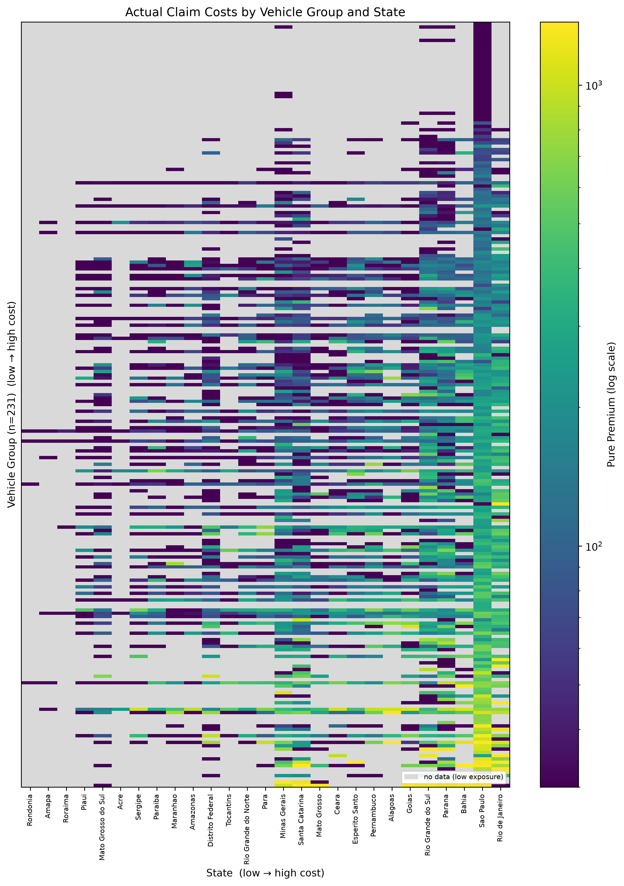
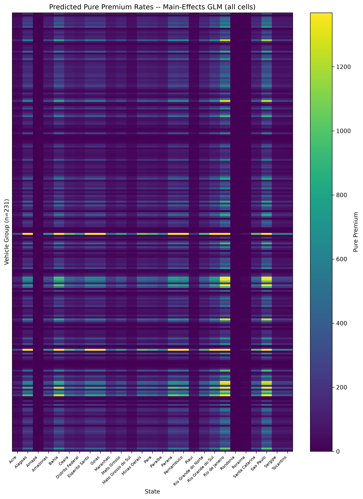
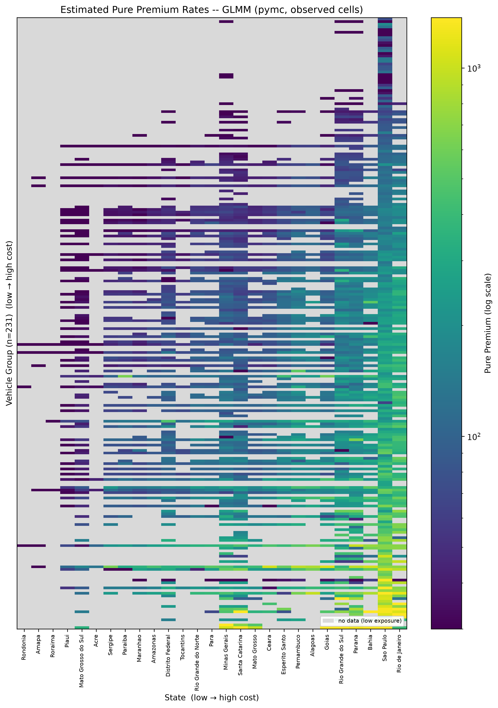
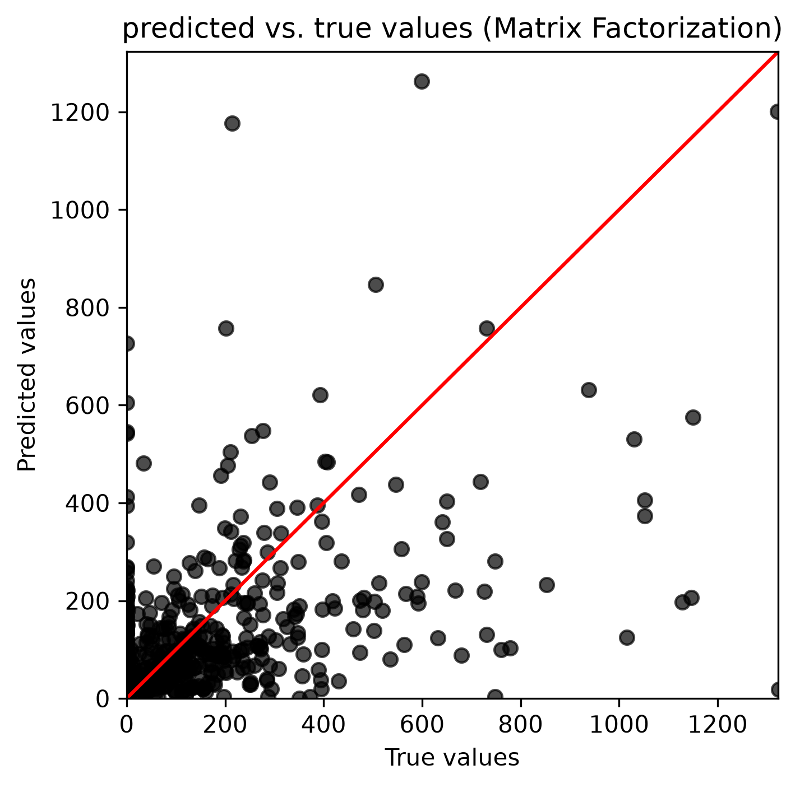
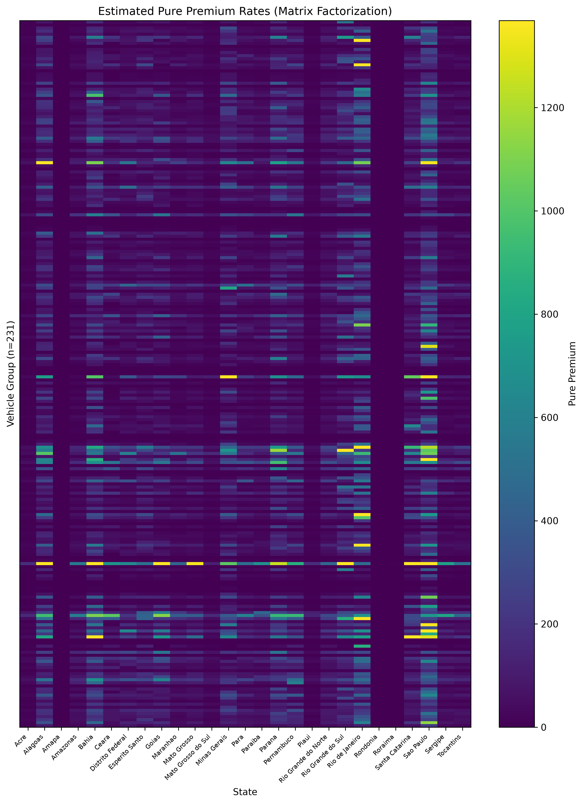
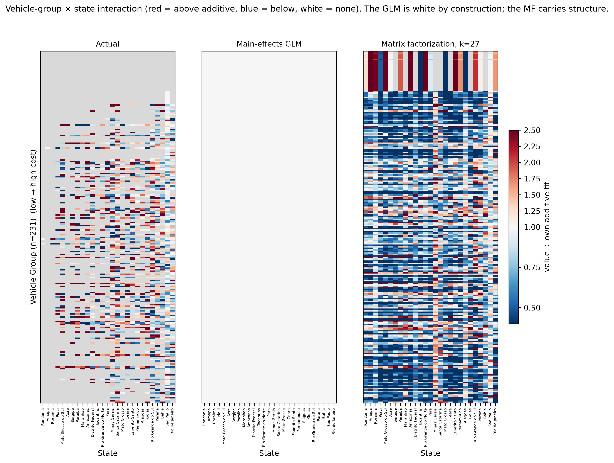

**クラス料率算定における高次元交互作用のモデリングのための行列分解 — 車両盗難への応用**

*著者： Nana Kato, Suguru Fujita, Shunichi Nomura*

提出先：

第33回 国際アクチュアリー会議（ICA2026）

2026年11月8日～13日

*本稿は第33回国際アクチュアリー会議のために作成されたものである。*

*日本アクチュアリー会（IAJ）および国際アクチュアリー会（IAA）は、本稿および付随資料に述べられた意見・内容について一切の責任を負わない。また、本稿に含まれる意見・内容はIAJおよびIAAの見解を反映するものではない。*

Nana Kato, Suguru Fujita, Shunichi Nomura

IAJおよびIAAは、本稿の全ての複製において著者を明示し、上記の著作権表示を含めることを保証する。

> **翻訳に関する注記：** 本ファイルは英語版 `ICA2026_Matrix_Factorization_for_Class_Ratemaking.md` の日本語訳である。ICAへの提出物は英語版が正本であり、本訳は著者の理解・作業用である。数式・図・表・参考文献は原文のまま保持している。以下のAbstractは採択済み（accepted）の英語アブストラクトの参考訳である。

## Abstract（採択済み・参考訳）

**主分野**：損害保険
**副分野**：データサイエンス／AI
**キーワード01**：行列分解（Matrix Factorization）
**キーワード02**：クラス料率算定（Class Rate-Making）
**キーワード03**：交互作用（Interaction）

本研究は、レコメンダーシステムで広く用いられる技術である行列分解（Matrix Factorization）を、保険のクラス料率算定への新しいアプローチとして導入する。我々は、地域や車種といったカテゴリ変数およびそれらの交互作用の高次元性を扱うという、アクチュアリー科学における重要な課題に取り組む。これらの変数はしばしば複雑な交互作用を示す一方で、現代の保険ポートフォリオは典型的にスパースな事故実績に悩まされる。従来の統計モデルがこのような高次元交互作用を扱うのに苦労してきたのに対し、我々の行列分解アプローチは潜在因子の積を通じてそれらを効率的に推定し、パラメータ数を大幅に削減する。さらに、我々のアプローチは交互作用の単純かつ直截的な表現を提供する。これは純保険料の設定における説明責任（アカウンタビリティ）に不可欠でありながら、他の機械学習手法ではしばしば見落とされてきた点である。その性能を実証するため、極めて高次元の変数を含む実世界の自動車保険データセットを用いた比較分析を、ここでは**車両盗難（robbery）ペリル**に適用して行った。盗難の純保険料率は、衝突事故に比べて車種×地域の交互作用が格段に強いという特徴を持つ。提案モデルは、安定した行列分解のためのR/Pythonライブラリであるcmfrecを用いて実装・最適化し、潜在因子の数と正則化の重みは交差検証によって決定した。次いで、アクチュアリー実務で一般的な標準的な一般化線形モデル（GLM）および一般化線形混合モデル（GLMM）との性能比較を行った。その結果、行列分解はこの交互作用を高ランクの分解によって捉え、非加重RMSEでは最も精度の高いモデルとなった。さらに重要な点として、本手法が本来対象とするスパースな露出セグメントにおいては、露出加重RMSEとポアソン逸脱度の両方で主効果GLMを上回った一方、データの豊富な（密な）セグメント—プールした指標を支配する—ではGLMも依然として競争力を保った。本研究は、従来モデルが苦戦するまさにスパースかつ高交互作用の設定において、行列分解がアクチュアリーにとって強力な代替手段となることを検証するものである。

# 序論

保険料率の算定において、クラス料率の決定は、多数のカテゴリを含む変数や欠測データを扱う際にしばしば困難を伴う。例えば自動車保険のタリフでは、地理的地域や車両メーカーといった多数のカテゴリを持つ変数が頻繁に用いられ、これらと他の変数との交互作用がモデルに組み込まれることが多い。

　交互作用は、個々の変数だけでは説明できない効果を捉えるための重要なモデリング要素である。例えば、特定のメーカーの損害率が特定の地域で著しく高い（あるいは低い）といった、地域と車両メーカーの間の特有の関係が存在しうる。しかし、いずれも多数のカテゴリを持つ変数どうしの交互作用を考えると、可能な組合せの数は膨大になる。これは、データの不均衡による露出（エクスポージャ）不足のセグメントや、データが完全に欠測しているセグメントを生じさせ、モデリングの難しさをさらに高める。

　従来の一般化線形モデル（GLM）で交互作用項を導入することでこうした関係を考慮することは可能だが、カテゴリ数が増えるにつれて係数推定の精度が低下し、解釈可能性の問題が生じる。したがって、適切なモデリングのためには代替的アプローチの導入が必要となる。

広く用いられている代替手段の一つが一般化線形混合モデル（GLMM）であり、これは高カーディナリティの因子およびその交互作用に対して変量効果を導入することでGLMを拡張する（例：Hammad & Harby, 2016）。もう一つの重要な方向性は、高次元GLMに適用される正則化手法である（例：Takahashi & Nomura, 2023）。いずれのアプローチも、弱い、あるいは裏付けの乏しい交互作用項をゼロに縮小（シュリンク）することで、過学習を抑え安定性を高める。並行して、ニューラルネットワークなどの機械学習手法（例：Richman & Wüthrich, 2024）も、非線形性や交互作用を自動的に捉える能力から広く採用されてきた。

　一方で、レコメンダーシステムなどの分野では、行列分解（Matrix Factorization）はデータのスパース性や欠測に対する高いロバスト性で知られ、広く用いられている技術である。加えて、機械学習手法と比較して、行列分解は潜在因子をデータ内の背後にある構造や関係として理解できることが多いため、比較的高い解釈可能性を持つ。さらに、未観測の交互作用効果をゼロに縮小しがちな変量効果モデルや正則化手法とは異なり、行列分解はそのような交互作用を、強制的に消失させることなく潜在因子構造を通じて自然に補完（インピュート）できる。保険データはスパース性や欠測に関して類似の課題を共有しているにもかかわらず、こうした行列分解手法が保険料率算定に適用された事例は極めて少ない。

　本研究では、行列分解を用いた新しいクラス料率算定手法を提案する。具体的には、高次元カテゴリデータや欠測値が存在する環境でも適用可能なアプローチを探るために行列分解（MF）を用いる。本手法の有効性を実証するため、従来のクラス料率算定手法と比較し、その利点と課題を論じる。

　本稿の構成は以下のとおりである。第2節では従来のクラス料率算定手法を、特に交互作用に関する既存の課題に焦点を当てて概観する。第3節では行列分解技術の概要を示し、その保険料率算定への応用を論じる。第4節では、提案手法の有効性を示すために実データを用いた分析結果を提示する。最後に第5節で結論と今後の研究方向について述べる。

# クラス料率算定の既存手法

## 一般化線形モデル（GLM）

一般化線形モデル（GLM）は、クラス料率の算定に広く用いられてきた。GLMは、柔軟な誤差構造とリンク関数を許容することで線形回帰を一般化する。応答変数の期待値 E[Y] を、リンク関数 g(∙) を介して説明変数 Xi の線形結合に関連付けることで、モデルは次のように表される：

$$g\!\left(E[Y \mid X_1, X_2, \ldots, X_p]\right) = \beta_0 + \beta_1 X_1 + \beta_2 X_2 + \cdots + \beta_p X_p$$

- Y：応答変数（例：事故頻度、事故severity、損害率）

- g(∙)：リンク関数（例：恒等関数、対数関数、ロジット関数）

- β0, β1,⋯βp：回帰係数

- X1,⋯Xp：説明変数（例：年齢、性別、車両メーカー、地域、走行距離）

GLMは説明変数間の交互作用や非線形関係を組み込むことができる。例えば、年齢と走行距離の組合せは、各要因を単独で考えた場合とは異なる効果を持つ可能性がある。このような場合、交互作用項 $X_i X_j$ を説明変数として加えることでその関係を捉えられる：

$$g\!\left(E[Y \mid X_1, X_2, \ldots, X_p]\right) = \beta_0 + \sum_{i=1}^{p} \beta_i X_i + \sum_{i=1}^{p-1}\sum_{j=i+1}^{p} \beta_{ij} X_i X_j$$

ここで βij は Xi と Xj の交互作用に対する回帰係数を表す。さらに、応答変数が説明変数に対して非線形に増加する場合には、二次項 $X_i^2$ のような高次項を加えることもできる。

　しかし、変数が多数のカテゴリを持つ場合、これらの交互作用項はモデルの複雑さを著しく増大させ、解釈可能性と安定性の問題を引き起こす。例えば、数百から数千のカテゴリを持つ「車両メーカー」のようなカテゴリ変数を考えてみる。これと別のカテゴリ変数（例：地域）との交互作用を考えると、可能な組合せの数は膨大になる。そのようなすべての交互作用項を明示的にGLMに含めると、以下の問題が生じる：

モデルの複雑さ：説明変数の膨大な数によりモデルが極めて複雑になり、解釈可能性を損ない、計算コストを増大させる。

過学習：多数の交互作用項を加えることで、モデルが学習データに過適合し、未知データに対する予測性能が低下するリスクが高まる。

多重共線性：複数の変数が相互に関連していると多重共線性が生じ、係数推定が不安定で解釈が困難になる。

スパース性：特定のカテゴリ組合せのデータが乏しい、あるいは完全に欠測している場合、その交互作用項の係数を正確に推定することが困難になる。欠測値の処理は、単純な補完手法がバイアスを持ち込みうるため、慎重な検討を要する。

## 一般化線形混合モデル（GLMM）

GLMの限界、とりわけ高次元カテゴリ変数を扱う際の過剰パラメータ化と過学習の問題に対処するため、一般化線形混合モデル（GLMM）がしばしば検討される。GLMMは、従来の固定効果に加えて、高カーディナリティの因子およびその交互作用に対する変量効果を導入することで、標準的なGLMを拡張する。

数学的には、特定のカテゴリ水準に対応する変量効果を組み込むことで、モデルは個々の変数を列挙して次のように表される：

$$g\!\left(E[Y \mid X_1, \ldots, X_p, u_1, \ldots, u_q]\right) = \beta_0 + \sum_{i=1}^{p} \beta_i X_i + \sum_{l=1}^{q} u_l Z_l$$

ここで u1,u2,…,uq は共通の分布 $N(0, \delta^2)$ に従うと仮定される変量効果を表し、Z1,Z2,…,Zq は変量効果に対応するダミー変数である。クラス料率算定の文脈では、標準的な説明変数には固定効果 β1X1,β2X2,…,βpXp が用いられ、車両メーカーや地域のような高カーディナリティ因子およびその交互作用には変量効果 u1Z1,u2Z2,…,uqZq が導入されるのが典型的である。

変量効果を導入する主な利点は、それに内在する部分プーリング（partial pooling）の仕組みにある。特定のカテゴリ組合せのデータが乏しい、あるいは欠測している場合、GLMMはそれらの組合せの変量効果が共通の分布から抽出されると仮定する。この分布仮定は、弱い、あるいは裏付けの乏しい交互作用項を自然にゼロへ縮小し、過学習を抑え安定性を高める。

しかし、GLMMは正則化を通じてスパース性を扱うロバストな統計的枠組みを提供する一方で、未観測または裏付けの弱い交互作用効果はゼロに向かうと仮定する。それらは、欠測データを説明しうる背後の潜在構造を明らかにしようとはしない。第3節で導入する行列分解は、そのような交互作用を強制的に消失させることなく潜在因子構造を通じて自然に補完することで、この特定の限界に対処する。

# 行列分解を用いたクラス料率算定

## 行列分解

行列分解（MF）は、もともとレコメンダーシステムや自然言語処理の分野で開発された技術である。高次元データを低次元の潜在因子へ分解することで、MFはデータの背後にある構造を効率的に捉えることができる。

　本節では、レコメンダーシステムの文脈におけるMFの問題設定と推定手法を説明する。基本的な設定では、m人のユーザーのn個のアイテムに対する選好が、m×n次元の非負行列 X として観測される。しかし実際には、大規模行列 X の要素のうちごく一部しか観測されない。したがって X は、ほとんどの要素が欠測しているスパースな行列であるのが典型的である。レコメンダーシステムの目的は、X の構造を学習し、欠測値を適切に補完することにある。これにより、すべてのアイテムに対するユーザーの選好を予測して適切なアイテムを推薦できる。以下では、広く用いられる2つの技術、特異値分解（SVD）と非負値行列因子分解（NMF）を紹介する。

### 特異値分解（SVD）

SVDは、観測行列 X を次のように分解する手法である：

$$X \approx U \Sigma V^{\top}$$

この式において、U は左特異ベクトルからなる直交行列、Σ は特異値を含む対角行列、V は右特異ベクトルからなる直交行列である。レコメンダーシステムでは、Σ のランク（非ゼロの対角要素の数）を m や n よりはるかに小さい値に制限する。これにより、観測行列 X を低次元の潜在因子空間へ写像し、ユーザーの選好を学習できる。

　完全な行列に対してSVDを効率的に計算する標準的なアルゴリズムは存在するが、レコメンダーシステムに現れるスパース行列には直接適用できない。代わりに、勾配ベースの最適化や交互最小二乗法（ALS）を用いてパラメータを推定する。SVDの主な利点は、ノイズを除去しつつ次元削減できる点にある。しかし、観測行列 X が非負値のみを含む場合、SVDに基づく補完は負の値を生じうる。これを避けるため、以下の非負値行列因子分解がしばしばより効果的である。

### 非負値行列因子分解（NMF）

NMFは、非負の観測行列 X を次のように分解する技術である：

$$X \approx A B^{\top}$$

　この定式化において、A と B は少数の列を持つ非負行列であり、それぞれユーザーとアイテムの潜在因子を表す。レコメンダーシステムの文脈では、A はユーザーの特徴、B はアイテムの特徴を表し、その積がユーザーの選好の予測に用いられる。NMFの重要な特徴は、潜在因子行列 A と B が非負値に制約され、しばしば多くのゼロを含む点である。このゼロと非ゼロの明確な対比が、推定結果の解釈可能性を高める。

　非負行列 A と B は、通常、勾配ベースの最適化手法または交互最小二乗法（ALS）を用いて推定される。しかし、これらの手法は局所最適に収束しやすいため、適切な初期値を与えることが不可欠である。あるいは、次節で論じるように、正則化によって推定を安定化することもできる。

## 提案する行列分解モデル

行列分解の保険料率算定への応用に関する研究は、国際的な研究でも進展しつつある。損害保険の分野では、例えば Seo et al. (2022) がスパース非負値行列因子分解を用いて、攻撃的な運転挙動と運転リスクの関係を解釈可能な低ランク潜在リスク因子として抽出し、高リスクと低リスクの運転挙動を成功裏に区別した。Xie and Gan (2022) および Xie et al. (2025) は、ファジィクラスタリングを伴うスパース非負値行列因子分解を自動車保険の事故データに適用し、相対的な地域リスクの評価を行った。これらの研究は、行列分解が従来の統計手法と比べてより柔軟で高い解釈可能性を持つモデルを提供できることを示しており、アクチュアリー科学の分野における新しいアプローチとして期待されている。

　本研究では、行列分解を料率算定に直接適用するアプローチを提案する。前節で導入した非負値行列因子分解モデルをさらに精緻化した以下のモデルを用いる：

$$X \approx A B^{\top} + \mu\, \mathbf{1}_m \mathbf{1}_n^{\top} + b_A \mathbf{1}_n^{\top} + \mathbf{1}_m b_B^{\top}$$

これは Koren, Bell & Volinsky (2009) による*バイアス付き（biased）*行列分解モデルであり、全体平均と行／列のバイアス項が主効果を吸収することで、潜在因子の積 $AB^{\top}$ が残差である交互作用構造のみをモデル化する。ここで A はユーザーの潜在因子を表す m×k 行列、B はアイテムの潜在因子を表す n×k 行列、μ は全体平均、1m, 1n はそれぞれ m 次元・n 次元の全要素が1のベクトルである。さらに bA はユーザー固有のバイアスを表す m 次元ベクトル、bB はアイテム固有のバイアスを表す n 次元ベクトルである。上式で推定すべき変数は、A, B, bA, bB, μ の各要素である。これらは、非負制約の下での交互最小二乗法（ALS）に、L2正則化項（各要素の二乗和に基づくペナルティ項）を加えて推定される。パラメータ推定の最適化問題は次のように定式化される：

$$\min_{A,B,b_A,b_B,\mu}\; \left\lVert X - \left(A B^{\top} + \mu\, \mathbf{1}_m \mathbf{1}_n^{\top} + b_A \mathbf{1}_n^{\top} + \mathbf{1}_m b_B^{\top}\right) \right\rVert_F^2 + \lambda \left( \lVert A \rVert_F^2 + \lVert B \rVert_F^2 \right)$$

制約条件：A, B の要素はすべて非負

ここで $\lVert \cdot \rVert_F^2$ は二乗フロベニウスノルム、すなわち観測要素の二乗和である。加えて、交互作用項 $AB^{\top}$ のランクを決定する潜在因子行列 A, B の列数 k は、L2正則化項の重み λ とともに、候補値の中から交差検証によって選択される。

　本研究の目的はクラス料率算定への応用であるため、上記のモデルをレコメンダーシステムの文脈から料率算定の文脈へ**読み替えて**用いる。レコメンダーシステムでは行列 $X$ の行・列・各要素がそれぞれ「ユーザー」「アイテム」「評価値（選好）」を表すが、本研究ではこれらを次表のように、多数のカテゴリを持つ2つのリスク因子とその事故コストに対応させる。

| レコメンダーシステム | 本研究（クラス料率算定への応用） |
|---|---|
| ユーザー（行, $m$ 個） | 車種グループ |
| アイテム（列, $n$ 個） | 州（地域） |
| 評価値・選好（要素 $x_{ij}$） | 事故コスト（本研究では盗難のクレームコスト＝過去の実績純率, Σクレーム÷Σ露出） |
| ユーザー潜在因子 $A$ | 車種グループの潜在因子 |
| アイテム潜在因子 $B$ | 州の潜在因子 |
| ユーザーバイアス $b_A$ | 車種グループの主効果 |
| アイテムバイアス $b_B$ | 州の主効果 |
| 全体平均 $\mu$ | 全体の平均クレームコスト |
| 潜在因子の積 $AB^{\top}$ | 車種グループ×州の交互作用 |

　この読み替えにより、本モデルが構築するものは次のように理解できる。全体平均 $\mu$ と車種グループ・州それぞれの主効果（バイアス項 $b_A, b_B$）が各セル（車種グループ×州の組合せ）の平均的なクレームコスト水準を表し、潜在因子の積 $AB^{\top}$ が、主効果の和では説明できない車種グループ×州の交互作用を低ランク（$k$ 次元）で捉える。すなわち、観測行列 $X$ は事故コスト（本研究では盗難の過去のクレームコスト, historical pure premium rate）から構成され、行に車種グループ、列に州（地域）を対応させる。多数のカテゴリを持つリスク因子としては、次節の応用例で論じるとおり、地理的地域や車種といった変数を想定する。

　第2節で述べたとおり、多数のカテゴリを持つリスク因子間の交互作用の推定は、特定のカテゴリ組合せにおける欠測データのために課題となる。しかし提案アプローチでは、交互作用は潜在因子行列の積を用いた低ランク行列によって表現される。その結果、欠測データを含む組合せに対しても、各因子の効果を考慮した適切な予測が期待できる。

# 応用

## 分析の概要

本節では、自動車保険の事故データを用い、特に行列分解技術を用いて車種グループおよび州別の**車両盗難（robbery）の純保険料率**を推定する。

　盗難を分析対象に選んだのは、そのリスクが車種と地域の**交互作用**として現れることが先験的に強く予想され、交互作用を低ランク構造として推定する行列分解の実務的価値を示す好個の題材だからである。盗難は修理費のように車両単独で決まる（車種の主効果に近い）のではなく、車両の価値や転売市場にとっての魅力（誘因）と、地域の都市化・盗難車の転売／解体市場・検挙水準といった治安環境（機会）とが**重なる**セルで突出すると考えられ、これは主効果の和では捉えきれない交互作用そのものである。

　評価のベースラインを提供するため、まず2つの従来手法—交互作用項を持たない一般化線形モデル（GLM）と、交互作用を変量効果として扱う一般化線形混合モデル（GLMM）—の推定結果を提示する。続いて、比較対象として提案する行列分解アプローチによる推定結果を示す。これらの結果に基づき、保険業界におけるクラス別料率の決定に行列分解を適用することの実務的な有効性と利点を論じる。

## データセット

本分析では、ブラジルの自動車保険データからなるCASdatasetsライブラリの brvehins1 データセットを利用する。これらのデータはもともとAUTOSEG自動車保険統計システムから取得・加工されたものである。データセットは1,965,355件のレコードからなり、露出（エクスポージャ）、保険料、事故金額に関する詳細な情報を含む。利用可能な属性には、性別、年齢、車種グループ、車両年式、地域、州が含まれる。

　本研究では、特に多数のカテゴリを持つリスク因子である車種グループと州に焦点を当てる。予測の目的変数は、**盗難（robbery）の過去のクレームコスト**（＝盗難クレーム総額 `ClaimAmountRob` ÷ 総露出）である。ここでデータ上の注意点を述べておく。brvehins1 には火災・盗難担保専用の露出列 `ExposFireRob` が定義されているが、この列（および対になる保険料 `PremFireRob`）は**全データシャードでゼロのまま出荷されている**。したがって盗難専用の露出基盤は存在しない。そこで本分析では全体露出 `ExposTotal` を分母に用いる。

　**元データ**における露出（エクスポージャ）の分布を、車種グループ別（表4.1.1）および州別（表4.1.2）に示す。ここでの露出は全体露出 `ExposTotal` の合計であり、元データ全体（1,965,355レコード）にわたる。総露出は6,260,366、車種グループは436、州は27（ブラジルの27連邦単位）である。露出は両軸ともに強く偏っており、車種グループでは上位の大衆車数種（Vw Gol 1.0、Fiat Palio 1.0 など）が、州では São Paulo 単独で全体の約40%を占める。この偏りが、後述するセル（車種グループ×州）ごとの露出不足・欠測の背景にある。なお車種グループについては、元データの120,515レコード（露出264,376、全体の約4.2%）で車種グループのコードが欠損しており、これらは表4.1.1の436グループには含めず「未分類（VehGroup欠損）」として別掲した（構成比は総露出6,260,366に対する比率）。

表4.1.1：元データにおける車種グループ別のエクスポージャ量（フィルタ前、`ExposTotal` の合計。構成比は総露出6,260,366に対する比率、降順）。表を簡潔にするため、構成比1%未満の車種グループ（406車種）は「その他」に集約した。

| 車種グループ | エクスポージャ量 | 構成比 |
|---|--:|--:|
| Vw Volkswagen Gol 1.0 | 382,877 | 6.12% |
| Fiat Palio 1.0 | 352,579 | 5.63% |
| Outros | 321,277 | 5.13% |
| Gm Chevrolet Corsa 1.0 | 292,017 | 4.66% |
| Gm Chevrolet Celta 1.0 | 269,326 | 4.30% |
| Fiat Uno 1.0 | 205,731 | 3.29% |
| Ford Fiesta 1.0 | 174,494 | 2.79% |
| Toyota Corolla | 137,470 | 2.20% |
| Vw Volkswagen Fox 1.0 | 131,586 | 2.10% |
| Honda Civic | 128,329 | 2.05% |
| Ford Ka 1.0 | 119,284 | 1.91% |
| Honda Fit | 118,573 | 1.89% |
| Gm Chevrolet Corsa Acima De 1.0 | 118,403 | 1.89% |
| Gm Chevrolet Astra | 114,624 | 1.83% |
| Ford Eco Sport | 113,236 | 1.81% |
| Vw Volkswagen Gol Acima De 1.0 | 102,040 | 1.63% |
| Ford Fiesta Acima De 1.0 | 98,107 | 1.57% |
| Fiat Siena 1.0 | 94,701 | 1.51% |
| Gm Chevrolet Vectra | 94,610 | 1.51% |
| Vw Volkswagen Polo | 94,185 | 1.50% |
| Fiat Strada | 93,669 | 1.50% |
| Peugeot 206 | 90,720 | 1.45% |
| Fiat Palio Weekend | 83,404 | 1.33% |
| Fiat Palio Acima De 1.0 | 76,307 | 1.22% |
| Gm Chevrolet S-10 | 72,653 | 1.16% |
| Citroen C3 | 70,508 | 1.13% |
| Renault Clio 1.0 | 67,219 | 1.07% |
| Gm Chevrolet Meriva | 65,371 | 1.04% |
| Ford Focus | 65,305 | 1.04% |
| Gm Chevrolet Prisma | 65,231 | 1.04% |
| その他（406車種、各1%未満） | 1,782,155 | 28.47% |
| 未分類（VehGroup欠損） | 264,376 | 4.22% |
| **合計** | **6,260,366** | **100.00%** |

表4.1.2：元データにおける州別のエクスポージャ量（フィルタ前、`ExposTotal` の合計。構成比は総露出6,260,366に対する比率、降順）。参考として州別の盗難クレームコスト・面積・人口・人口密度を併記した。

| 州 | エクスポージャ量 | 構成比 | 盗難クレームコスト | 面積（km²） | 人口（2022年国勢調査） | 人口密度（hab/km²） |
|---|--:|--:|--:|--:|--:|--:|
| Sao Paulo | 2,516,721 | 40.20% | 314 | 248,223 | 44,411,238 | 178.92 |
| Minas Gerais | 549,146 | 8.77% | 124 | 586,522 | 20,539,989 | 35.02 |
| Rio de Janeiro | 545,110 | 8.71% | 330 | 43,780 | 16,055,174 | 366.72 |
| Parana | 461,825 | 7.38% | 204 | 199,308 | 11,444,380 | 57.42 |
| Rio Grande do Sul | 456,299 | 7.29% | 184 | 281,730 | 10,882,965 | 38.63 |
| Santa Catarina | 319,286 | 5.10% | 126 | 95,736 | 7,610,361 | 79.49 |
| Bahia | 218,011 | 3.48% | 233 | 564,733 | 14,141,626 | 25.04 |
| Distrito Federal | 181,900 | 2.91% | 101 | 5,780 | 2,817,381 | 487.44 |
| Goias | 181,272 | 2.90% | 191 | 340,112 | 7,056,495 | 20.75 |
| Pernambuco | 157,863 | 2.52% | 174 | 98,148 | 9,058,931 | 92.30 |
| Ceara | 105,807 | 1.69% | 138 | 148,921 | 8,794,957 | 59.06 |
| Esperito Santo | 95,828 | 1.53% | 165 | 46,096 | 3,833,712 | 83.17 |
| Mato Grosso | 69,155 | 1.10% | 128 | 903,366 | 3,658,649 | 4.05 |
| Mato Grosso do Sul | 60,444 | 0.97% | 55 | 357,146 | 2,757,013 | 7.72 |
| Para | 53,046 | 0.85% | 120 | 1,247,955 | 8,120,131 | 6.51 |
| Rio Grande do Norte | 52,742 | 0.84% | 105 | 52,811 | 3,302,729 | 62.54 |
| Paraiba | 46,149 | 0.74% | 88 | 56,470 | 3,974,687 | 70.39 |
| Alagoas | 41,279 | 0.66% | 185 | 27,779 | 3,127,683 | 112.59 |
| Sergipe | 34,509 | 0.55% | 79 | 21,915 | 2,210,004 | 100.84 |
| Maranhao | 33,471 | 0.53% | 89 | 331,937 | 6,776,699 | 20.42 |
| Piaui | 24,199 | 0.39% | 31 | 251,578 | 3,271,199 | 13.00 |
| Amazonas | 23,649 | 0.38% | 85 | 1,559,159 | 3,941,613 | 2.53 |
| Tocantins | 18,226 | 0.29% | 93 | 277,721 | 1,511,460 | 5.44 |
| Acre | 5,432 | 0.09% | 54 | 164,123 | 830,018 | 5.06 |
| Amapa | 3,626 | 0.06% | 26 | 142,829 | 733,759 | 5.14 |
| Roraima | 2,945 | 0.05% | 31 | 224,301 | 636,707 | 2.84 |
| Rondonia | 2,420 | 0.04% | 56 | 237,591 | 1,581,196 | 6.66 |
| **合計** | **6,260,366** | **100.00%** | **234** | **8,515,770** | **203,080,756** | **23.85** |

注：**盗難クレームコスト**は元データ全レコードでの露出加重値（Σ`ClaimAmountRob`／Σ`ExposTotal`）であり、観測セルに限定した第4.2節の周辺値とはわずかに異なりうる。**面積・人口**はIBGE 2022年国勢調査（面積は連邦単位の公式値、人口は2022年国勢調査人口）。**人口密度**は本表の人口÷面積で算出した（hab/km²）。

　図4.2.1は、まず各セル（車種グループ×州の組合せ）ごとに過去の実績から盗難のクレームコストを算出し、それをヒートマップとして可視化したものである。ここでのクレームコストとは、各セルの盗難クレーム総額 `ClaimAmountRob` を総露出 `ExposTotal` で割った単位露出あたりの盗難コストである。色が濃い（値が高い）セルほど、その車種グループと州の組合せで盗難コストが大きいことを表す。

　分析にあたり、契約量が少ない場合には過去データからクレームコストを統計的に決定するのが難しいため、総露出が100未満のセル（車種グループ×州の組合せ）は欠測に変換した。さらに、総露出が10に満たない車種グループはモデル構築から除外した。この結果、学習用の行列は231車種グループ × 27州、観測セル数2,233（全体の約36%が観測）となる。その他すべての組合せは、提案する行列分解アプローチによって推定される欠測値として扱う。以降のヒートマップ（図4.2.1、4.3.1、4.4.1、4.5.2）は、この231車種グループ（行）× 27州（列）の行列を表示する。全ヒートマップは共通のカラースケールを用い、右に歪んだクレームコストの分布を暗部に潰さず広げるため対数スケールで描画する。欠測セルはグレーで示す。あるセルが未観測であるのはまさにそのセルの露出がほとんど、あるいは全くないためである。

図4.2.1：車種グループおよび州別の実際の盗難クレームコスト

　図4.2.1から、盗難クレームコストが車種グループ（行）と州（列）の**両方**の方向に大きく変動していることが読み取れる。露出加重のクレームコストは車種グループ間で0〜約1,810、州間で約2〜329に及び、いずれの軸も広い開きを持つ。車種グループのうち盗難コストが最も高いのは大型トラック（Scania、Iveco Stralis、Volvo の *Caminhões*）、商用バン（Mercedes-Benz Sprinter）、大型二輪（>450cc の Yamaha・Suzuki）、および高級車（Peugeot 407、Toyota Land Cruiser）であり、最も低いのは小型二輪と旧型大衆車である。これは修理コストではなく、車両の価値と盗難者にとっての魅力を反映した順序であると考えられる。州の方向では地理的勾配が際立ち、盗難コストは人口密度の高い南東部・沿岸大都市—Rio de Janeiro（329）と São Paulo（314）、次いで Bahia、Paraná、Rio Grande do Sul—で最も高く、人口の希薄な北部・フロンティア州（Rondônia ≈ 2、Amapá ≈ 2、Roraima ≈ 7）で最も低い。

　しかし、車種グループと州それぞれの主効果（行・列の平均的な高低）だけでは、図4.2.1のヒートマップは説明しきれない。ある車種グループの盗難コストの高低は州によって変わり、逆にある州のなかでも車種グループごとの高低の並びは一様ではない。この「行と列の組合せ（セル）に固有の上振れ・下振れ」こそが車種グループ×州の**交互作用**であり、主効果の単純な和では捉えられないものと考えられる。

## 交互作用項を持たないGLM

アクチュアリー実務では、膨大な数のカテゴリ組合せに対して交互作用項を明示的に定義することは、技術的に困難で計算的にも複雑とみなされることが多い。そのため、交互作用項を持たない一般化線形モデル（GLM）が実務的なベースラインとして一般的に用いられる。まずこの基本的なアプローチをデータセットに適用する。この主効果のみの定式化は意図的に最も単純なベースラインである点を強調しておく。より強力なGLMベンチマークは正則化された交互作用項—例えば Takahashi & Nomura (2023) のグループ融合ラッソ（group fused lasso）—を組み込むものであり、これは今後の課題とする。

　前述のとおり、モデルは以下のように定義される：

車種グループ i、州 j の総事故金額を Yij、対応する露出を Eij とする。モデルは次のように定義される：

$$Y_{ij} \sim \mathrm{Poisson}(\lambda_{ij} E_{ij})$$

$$\ln E[Y_{ij}] = \ln E_{ij} + \beta_0 + \alpha_i + \tau_j$$

ここで：

- E[Yij] は期待総事故コスト。

- ln Eij は露出水準の違いを考慮するオフセット項として機能する。

- β0 は切片。

- αi と τj はそれぞれ車種グループと州の主効果を表す。この定式化は車種グループと州の間に交互作用がないことを仮定している点に注意されたい。モデルはデータが存在する観測セルのみを用いて当てはめられる。

　車種グループおよび州別の純保険料率の推定結果を図4.3.1に示す。主効果GLMは全セルを埋められるため、図4.3.1は全カテゴリ（車種グループ×州のすべての組合せ）に対する予測を表示している。

図4.3.1：主効果GLMによる純保険料率の予測ヒートマップ

（交互作用項なしのGLM。全カテゴリを表示しており、図4.2.1で低露出のため欠測だったセルの値は外挿による。）

推定結果の特徴を以下にまとめる：

- 単純さと交互作用モデリングの限界：このアプローチは直截的で解釈が容易な一方、交互作用効果を考慮できない。その結果、ヒートマップは車種グループと州にわたって比例的な色の変化を示す。さらに、非欠測セルの推定値が過去データから乖離しており、モデルが必ずしも実際のリスクプロファイルと整合しないことを示している。

- 欠測値への外挿：全カテゴリに一律の係数を適用することで、欠測データのセルについても料率を計算できる。しかし、モデル構築用データセットに全く含まれていなかったカテゴリ（図4.2.1で低露出のため欠測だったセル）については、その結果は観測データに基づく推定ではなく単なる外挿にすぎない。

## 交互作用を変量効果とするGLMM

一般化線形混合モデル（GLMM）はGLMの拡張であり、固定効果と変量効果の両方を含めることを可能にする。これは相関データやクラスタ化データのモデリングに特に有用である。本節では、主効果GLM（第4.3節）の変数を固定効果として扱い、車種グループと州の交互作用を変量効果として組み込むことで交互作用効果を考慮するモデルを検討する。

モデルは以下のように定式化される：

$$Y_{ij} \sim \mathrm{Poisson}(\lambda_{ij} E_{ij})$$

$$\ln E[Y_{ij}] = \ln E_{ij} + \beta_0 + \alpha_i + \tau_j + z_{ij}$$

ここで zij~$N(0, \delta^2)$ は車種グループ i と州 j の交互作用に対する変量効果を表す。式中の他の変数の定義は第4.3節で述べたものと同じである。

　観測（非欠測）セルに対する推定結果を図4.4.1に示す。本モデルの完全ベイズ推定は、明確に識別される交互作用を与える。交互作用の標準偏差の事後平均は σ ≈ 0.143 であり、観測セル上での実際の料率とGLMM事後平均料率の相関は0.925である。この大きな σ は、盗難については車種グループ×州の交互作用が観測セル上で実質的な信号を持つことを裏づける。しかし決定的なことに、これはスパースなペリルで問題となるセルには役立たない。変量効果 $z_{ij}$ は交互作用が観測された箇所でしか推定できず、未観測の組合せではGLMMの予測は依然として主効果に回帰する（第4.6節）。GLMMが標本内では当てはめられるが標本外には拡張できない真の交互作用を持つペリルこそ、まさに行列分解を動機づけるケースである。

図4.4.1：車種グループおよび州別の推定純保険料率（変量効果を持つGLMM）。グレーの領域は低露出のため欠測として扱うセルを表す。

推定結果の特徴を以下にまとめる：

- 観測データに対する交互作用モデリング：非欠測セルについては、GLMMは交互作用効果を成功裏に組み込み、特定の局所的変動を捉えることで主効果GLMよりも精緻な推定を可能にする。

- 欠測値に関する限界：このアプローチの主な課題は、変量効果 zij が観測された組合せに対してのみ推定可能である点にある。露出がゼロのセル（欠測データ）については、モデルは交互作用を予測する経験的根拠を欠き、推定は主効果に回帰（revert）してしまう。

- 分布仮定の破綻：全州・全車種グループにわたる交互作用効果が単一の正規分布に従うという基本仮定は、過度に制約的である可能性がある。実世界の保険リスクはしばしば複雑な局所クラスタを示し、単純な $N(0, \delta^2)$ の仮定ではこれを正確に捉えられない。

- 総合的な有効性：その結果、GLMMアプローチは高スパース性を特徴とするデータセットに対しては特に有効とは言えない。交互作用効果が最も必要とされる多数の欠測カテゴリ組合せに対して信頼できる予測力を提供できないためである。

## 行列分解（MF）

本節では、cmfrecライブラリ（Cortes, 2018。本稿で報告する分析はそのPython実装を用いる）を用いて提案する行列分解アプローチを適用する。このライブラリはRとPythonの両方で利用可能な行列分解の標準的なツールである。勾配ベースの手法や交互最小二乗法（ALS）を含む様々な最適化アルゴリズムを実装し、L1およびL2正則化の両方をサポートする。加えて、劣悪な局所最適への収束を避けるために著者が設計した特定の初期化戦略を組み込んでいる。モデルは3.2節で定式化したとおりである。

　モデルの実装に関しては、最適化に交互最小二乗法（ALS）を、正則化にL2正則化を用いる。いずれもライブラリ内のデフォルト設定である。推定される因子が料率算定に有効な範囲に収まるよう、nonneg パラメータを TRUE に設定して厳密な非負制約を課す。さらに、center パラメータを FALSE に設定して平均中心化（mean-centering）を回避し、非負観測行列の元のスケールと整合性を維持する。なお、非負制約は潜在因子行列 A と B には適用されるが、バイアス項 μ, bA, bB には適用されない。したがって当てはめ値は厳密には非負であることが保証されず、実務上必要な場合には予測料率をゼロで下限打ち切り（floor）すべきである。

- 交差検証によるハイパーパラメータ最適化

潜在因子数 k（候補：2〜27の整数）と正則化の重み λ（候補：0.01, 0.1, 1, 10, 20, 30, 50, 100, 1000）は、これらの候補からなるグリッド上での4分割交差検証によって選択し、平均の露出加重RMSE（Root Mean Square Error）を最小化する組合せを選んだ。k の探索上限を27としたのは、ランクが行列の小さい方の次元（27州）で頭打ちになり、k > 27 では州側の因子行列（27×k）が過剰パラメータとなって表現力が増えないためである。テストセットはこのチューニングの前に取り分けてあり、ハイパーパラメータ選択が評価セルを見ることはない。盗難の行列分解では、この手続きは**高ランク（k=27。探索グリッドの上限）と正則化の重み λ=100** を選んだ。ここでは交差検証が追加の潜在次元を実際に報いている。言い換えれば、盗難は車種×地域の交互作用が十分に大きく、モデルがそれを表現するために豊かな低ランク構造を欲するペリルであり、まさに行列分解が想定する領域である。

- モデルの学習と検証

予測性能を評価するため、データの25%をテストセットとして確保し、残り75%をモデル構築に用いるホールドアウト検証を実施した。適合度はテストデータに対して計算したRMSEで評価した。図4.5.1は純保険料率の予測値対真値（行列分解）を示しており、実際のクレームコストとモデル予測との相関を可視化している。データ点が対角線（identity line）上に集中していることは、行列分解モデルがホールドアウトのテストセットに対しても背後にあるリスクパターンを成功裏に捉えていることを示している。

- 全カテゴリの純保険料率の推定

最終推定では、全データセットを入力としてモデルを再学習した。これにより、当初は低露出のため欠測として扱っていたセルを含め、すべての車種グループ×州の組合せについて純保険料率を推定できた。全カテゴリの結果ヒートマップを図4.5.2に示す。

図4.5.1：純保険料率の予測値対真値

（行列分解）

図4.5.2：車種グループおよび州別の推定純保険料率（行列分解）

推定結果の特徴を以下にまとめる：

- 欠測カテゴリに対するロバストな推定：未観測セルに苦戦するGLMMとは異なり、行列分解アプローチは行列全体について純保険料率を成功裏に推定する。非欠測セルについては推定値が第4.2節の過去データと高い整合性を保ち、欠測セルは車種グループと州の背後にある潜在因子に基づいて妥当な値に補完される。

- 非線形交互作用の捕捉：結果として得られるヒートマップ（図4.5.2）は、主効果GLMに見られる厳密に比例的な変化ではなく、非一様なパターンを示す。これは潜在因子行列の内積を通じて導入された交互作用構造を反映している。図4.5.3はこの交互作用を直接取り出す。各サーフェスを、そのサーフェス自身の加法的（車種グループ＋州）当てはめで割ることで、1（白）は「主効果で完全に説明される」ことを意味し、そこからの逸脱が純粋な交互作用となる。主効果GLMは構成上どこも白であるのに対し、高ランク（k=27）の行列分解は顕著な赤／青の構造を示す。この密な構造は、盗難が車種グループ×州の交互作用を実質的に帯びることと整合的である。ただし、視覚的により豊かなヒートマップは、それ自体がより正確な料率の証拠ではない点に注意すべきである。モデルは第4.6節（表4.5.1）の予測比較によって判断されるべきである。

- 予測の信頼性：図4.5.1はホールドアウトセットにおける予測値と真値の正の相関を示しており、モデルが単に学習データに過適合しているわけではないことを示している。第4.6節の直接比較（head-to-head）が示すとおり、観測セルにおいて行列分解は非加重RMSEで最も精度が高く、スパース層では露出を考慮した指標でも最良だが、全セルでプールした露出加重指標では主効果GLMがわずかに上回る。行列分解のさらに特徴的な価値は欠測セルの扱いにあり、これは同節および結論で論じる。

交互作用行列を低ランクの積として表現することで、本モデルはスパースな保険データに内在するランダムノイズを除去し、少数の潜在因子を通じてリスクを表現するよう設計されている。これらの因子は、例えば類似の安全性プロファイルを持つ車種グループや、同程度の盗難率を持つ州に対応しうる。ただし、本分析は推定された因子に特定の意味的解釈を確立するものではない点に留意されたい。それらを実質的に解釈するにはさらなる研究を要する。

図4.5.3：車種グループ×州の交互作用。各サーフェスをそのサーフェス自身の加法的（主効果）当てはめで割って示す。赤＝加法ベースラインより上、青＝下、白＝交互作用なし。主効果GLMは構成上どこも白であり、k=27の行列分解は密な構造を帯びる。

## 予測性能の比較

前節までは各モデルの推定を個別に提示した。これらを対等な土俵で比較するため、主効果GLM、GLMM、および行列分解を、観測セルの同一のホールドアウトセット上で評価した。公正な比較のためには2つの調整が不可欠である。第一に、行列分解の損失を露出で加重し、GLMとGLMMが offset(ln Eij) 項を通じて適用する露出加重と整合させる。これがなければ、露出100に裏付けられたセルが数万の露出に裏付けられたセルと同じ重みを持つことになり、アクチュアリー的に正当化できない。第二に、純保険料のRMSEに加えて、露出加重RMSEと総事故スケールでのポアソン逸脱度（Poisson deviance）を報告し、最大のセルに支配される非加重の通貨スケール誤差ではなく、比較可能で露出を考慮した基準でモデルを判断する。

表4.5.1：観測セルの同一547セット上でのホールドアウト予測性能（低いほど良い）。ハイパーパラメータは、最終フィットと同じ非負・非中心化（non-centered）・露出加重の仕様を用いた交差検証で再選択した。盗難では基準が豊かな分解を報いる（行列分解は $k=27$, $\lambda=100$）。

| モデル | RMSE | 露出加重RMSE | ポアソン逸脱度 |
|---|---:|---:|---:|
| GLM（主効果） | 253.78 | **178.52** | **1.45×10⁸** |
| GLMM（変量交互作用）† | 253.78 | 178.52 | 1.45×10⁸ |
| 行列分解‡ | **237.27** | 195.20 | 2.04×10⁸ |

† ホールドアウトの各セルは*未観測*の車種グループ×州の交互作用水準である。したがってGLMMの交互作用変量効果 $z_{ij}$ は推定の根拠となるデータを持たずゼロに回帰するため、GLMMのホールドアウト予測は主効果GLMのそれと一致し、同じ誤差に到達する。これは当てはめのアーティファクトではなく、第4.4節で述べたGLMMの限界の具体的な数値的表現である。（第4.4節の観測セルヒートマップに用いた収束済みのベイジアンGLMMは*別の*、完全にサンプリングされた当てはめであり、これら未観測交互作用セルにおいては同様に主効果へと帰着する。）

‡ 行列分解の損失は（加重）二乗誤差であるのに対し、GLMとGLMMはポアソン尤度を最適化する。したがってMFは、露出加重RMSEとポアソン逸脱度の列において、それ自身が最小化していない基準で採点されている。MFは*非加重*RMSEでは最小だが、露出を考慮した2列ではGLMが下回る—このプールした結果は後掲の層別分析が明確に条件づける。

プールした全体像は率直に言って混在しており、そのまま報告する。行列分解は**非加重RMSE**で最小（237.27 対 GLMの253.78）であり、高ランクで捉えた交互作用構造を反映している。しかし2つの**露出加重**指標では、547セル全体でプールすると主効果GLMが上回る（露出加重RMSE 178.52 対 195.20、ポアソン逸脱度 $1.45\times10^8$ 対 $2.04\times10^8$）。GLMMは（各ホールドアウトセルが未観測交互作用で変量効果がゼロに回帰するため）GLMと完全に同点となる。この結果の理由は示唆に富む。露出加重指標は最も露出の大きい（密な）セルに支配され、層別表が示すとおり、その密な領域こそGLMの主効果が最も打ち破りにくい場所だからである。スパースなペリルにとって重要な問いは、露出加重のプール平均ではなく、データが薄い箇所での性能である。

利用可能な唯一の真値—低露出の観測セル—を用いてスパース領域を精査するため、ホールドアウトセルを露出の中央値で層別した（表4.5.2）。ここでは結果が反転し、分解に有利となる。**スパース**層では、行列分解は露出を考慮した両指標でGLMを上回る（露出加重RMSE 244.51 対 270.02、ポアソン逸脱度 $2.20\times10^7$ 対 $3.59\times10^7$）。**密**層では順位が逆転しGLMが最良となる（露出加重RMSE 171.71 対 191.95、逸脱度 $1.09\times10^8$ 対 $1.82\times10^8$）。すなわち行列分解の優位は、本稿が関心を寄せる低露出セグメントにまさに集中しており、GLMのプール勝ちは主効果で十分なデータ豊富なセルによって駆動されている。なおスパース層もあくまで代理指標である点を強調しておく。真に欠測したセルはさらに少ない（典型的にはゼロの）露出しか持たず、これらの数値のいずれによっても保証できる範囲の外にある。

表4.5.2：露出で層別したホールドアウト性能（中央値で分割、スパース n=273・密 n=274、低いほど良い）。

| 層 | モデル | 露出加重RMSE | ポアソン逸脱度 |
|---|---|---:|---:|
| スパース（露出 < 中央値） | GLM / GLMM† | 270.02 | 3.59×10⁷ |
| スパース（露出 < 中央値） | 行列分解 | **244.51** | 2.20×10⁷ |
| 密（露出 ≥ 中央値） | GLM / GLMM† | **171.71** | **1.09×10⁸** |
| 密（露出 ≥ 中央値） | 行列分解 | 191.95 | 1.82×10⁸ |

したがってこの比較は次のように読むべきである。観測データ上で、行列分解は非加重RMSEで最も精度が高く、スパースな露出セグメントでは露出を考慮した指標でもGLMを上回る。主効果GLMが露出加重のプール平均で勝つのは、それが主効果ですでに系統的変動を捉える密なセルに支配されているためにすぎない。精度の比較を超えて、MFの特徴的な貢献は本稿が関心を寄せる領域にある。すなわち、GLMMが交互作用効果を全く決定できず、GLMが主効果を外挿することしかできない、露出がほとんど、あるいは全くないスパース・欠測セグメントである。そこでは、行列分解は3手法の中で唯一、交互作用を考慮した料率推定を依然として生成できる（第4.4節）。とりわけ盗難では、車種×州の交互作用が実質的に存在し（第4.2節）、GLMMが標本内では大きな σ を識別しながら標本外へは拡張できないため、この構造的な優位こそ行列分解を支持する論拠の核心である。

**限界。** 盗難の結果には2つの留意点がある。第一に、*属性構成の交絡*。セル目的変数（生の盗難クレームコスト = Σクレーム/Σ露出）は、車種グループ×州の交互作用に加えて各セルの契約者属性構成（性別・運転者年齢・車両年式のミックス）を混在させており、これはセル間で異なる。レコード単位の属性標準化は本分析では実施していないため、観測セルの精度数値は、車種×地域の純粋な交互作用ではなく潜在因子が属性構成を部分的に吸収した結果を含みうるものとして読むべきである。第二に、*露出基盤*。第4.2節で述べたとおり、brvehins1 には盗難専用の露出が存在せず（`ExposFireRob` が空）、`ExposTotal` を代用の分母としている。仮に盗難担保の付保対象部分ポートフォリオが包括担保のそれと系統的に異なるなら、水準は（ただし必ずしもセル間の順位ではなく）影響を受けうる。いずれの留意点も、MFの主たる主張—従来モデルが交互作用構造を提供できないスパース・欠測セグメントへ交互作用を考慮した推定を拡張するという構造的な利点—を損なうものではない。

## 露出しきい値に対する感度分析

セルの採否に用いた露出しきい値（総露出100以上）は信頼性を担保するための設計上の選択であり、その値自体はモデリング上の裁量である。そこで、しきい値を50・100・200に変えて同一プロトコル（分割を先に行いその後チューニング、露出加重、非負・非中心化、$(k,\lambda)$ の再選択）で再実行し、結論の頑健性を確認した。観測セル数は閾値50/100/200でそれぞれ2,688/2,233/1,771（評価セル654/547/426）と変化する。

表4.7.1に全体の露出加重RMSEを示す。閾値50および100（本文設定）では行列分解が主効果GLMをわずかに下回り最良であったが、閾値200では順位が逆転し主効果GLMが最良となった。すなわち観測セルの再現における行列分解のわずかな優位は、本文設定およびそれ以下の閾値では認められるものの普遍的ではなく、閾値を高くして密なセルに限定すると主効果GLMが上回る。この感度は、本文で述べた「観測セル上での行列分解の優位は小さく、精度そのものが行列分解の主たる利点ではない」という慎重な解釈と整合的である。

表4.7.1：露出しきい値を変えたときの全体ホールドアウト露出加重RMSE（低いほど良い）。各行は独立に再チューニングした。100が本文の設定である。

| 露出しきい値 | 観測セル | 評価セル | GLM | 行列分解 |
|---|---:|---:|---:|---:|
| 50 | 2,688 | 654 | 185.6 | 171.8 |
| 100（本文） | 2,233 | 547 | 181.0 | 167.3 |
| 200 | 1,771 | 426 | 131.4 | 138.2 |

# 結論と今後の課題

本研究では、**車両盗難ペリル**のクラス別料率算定に焦点を当て、多数のカテゴリ、著しいスパース性、そして実質的な車種×地域の交互作用を特徴とする目的変数に対するアプローチとして行列分解（MF）を検討した。本手法を実世界の保険データに適用した結果は以下のとおりである。盗難の交互作用構造は実在し、かつ大きい。ベイジアンGLMMは大きな交互作用標準偏差を識別し（σ ≈ 0.143）、交差検証は高ランクの分解を選ぶ（k=27）。予測精度の像は混在しており、誇張せず報告する。行列分解は非加重RMSEで最も精度が高く（237.27 対 GLMの253.78）、**スパース**な露出層では露出を考慮した両指標でGLMを上回る（露出加重RMSE 244.51 対 270.02、ポアソン逸脱度 $2.20\times10^7$ 対 $3.59\times10^7$）。しかし全セルでプールした露出加重指標では主効果GLMが上回る（178.52 対 195.20）。これはそれらの平均がデータ豊富な密セルに支配され、そこでは主効果で十分だからである。GLMMは、各ホールドアウトセルが未観測交互作用でありその変量効果がゼロに回帰するためGLMと同点となる。したがってMFの決定的な優位は、プールした精度の勝敗ではなく構造にある。すなわち、標本内では大きな交互作用を当てはめながら未観測の組合せへは持ち出せないGLMMとは異なり、MFは観測露出のないものを含め、すべての車種グループ×州セルに対して交互作用を考慮した推定を生成する。盗難は、採択済みアブストラクトの「GLMがしばしば失敗するスパースなセグメント」を特に明瞭に示す事例である。交互作用は明白に存在し、GLMMはそれを見ることはできても外挿できず、MFは3手法の中で唯一、スパース・欠測セグメントにわたって交互作用を考慮した料率を供給し、しかもまさにそこで最も精度の高いモデルであり続ける。我々はMFを、確立されたアクチュアリーモデルの全面的な代替としてではなく、まさにこのスパースで高交互作用の設定でこそ最大の価値を持つ補完的ツールとして位置づける。

　本研究は提案アプローチの有効性を確認したが、さらなる発展の余地がいくつか残されている：

- サイド情報の統合：各車種グループ・各州について観測可能な属性（メーカーや地域属性など）を、主要な事故行列と同時に分解して取り込む集合行列分解（Collective Matrix Factorization, CMF）は、自然な拡張である。より豊富な属性（車両の物理特性、より細かい地理的共変量など）が、従来モデルの苦手とするスパース・欠測セグメントの推定を改善しうるかは、今後の課題である。

- クレームコストに整合した損失族：提案モデルは（加重）二乗誤差損失を最小化するが、これは非負で裾が重く、盗難では強くゼロ過剰なクレームコストを近似的にガウス分布として扱い、最大のセルに支配される。この不整合は、盗難で行列分解が露出加重ポアソン逸脱度において劣った（それ自身が最適化していない基準で採点された）最も有力な説明であり、観測盗難セルの約4分の1がゼロを記録することを踏まえるとなおさら深刻である。したがって目的関数を事故生成過程に整合させることは、このペリルにとって特に自然な改良である。TweedieまたはポアソンガンマのDeviance損失（例：Jørgensen & Paes de Souza, 1994; Ohlsson & Johansson, 2010）の下で分解を当てはめれば、盗難クレームの頻度・severity構造に目的関数を整合させることができる。

- 多様なデータセットでの検証：本研究はブラジルの自動車保険データを用いた。知見の一般化可能性を確保するには、他の地域や、火災保険や医療保険など、カテゴリのスパース性が同様に一般的な課題となる異なる保険種目のデータセットを用いてモデルを検証することが不可欠である。

- 深層学習アプローチとの比較：今後の研究では、行列分解と、Neural Collaborative Filtering（NCF）のようなより複雑な深層学習アーキテクチャとの間のトレードオフ、特に予測力と、規制されたアクチュアリー環境で求められる解釈可能性との均衡についても探究しうる。

# 参考文献

**Cortes, D. (2018).** Cofactor and Collective Matrix Factorization models (cmfrec): a Python/R package for matrix factorization with side information. Software library. https://github.com/david-cortes/cmfrec

**Dutang, C., & Charpentier, A. (2020).** *CASdatasets: A Collection of Actuarial Datasets*. R package version 1.0-11.

**Hammad, M. S., & Harby, G. A. (2016).** Using Multilevel Modeling for Group Health Insurance Ratemaking. *Predictive Modeling Applications in Actuarial Science: Volume 2, Case Studies in Insurance,* 126.

**Jørgensen, B., & Paes de Souza, M. C. (1994).** Fitting Tweedie's compound Poisson model to insurance claims data. *Scandinavian Actuarial Journal*, 1994(1), 69–93.

**Koren, Y., Bell, R., & Volinsky, C. (2009).** Matrix factorization techniques for recommender systems. *Computer*, 42(8), 30–37.

**Ohlsson, E., & Johansson, B. (2010).** *Non-Life Insurance Pricing with Generalized Linear Models*. Springer.

**Richman, R., & Wüthrich, M. V. (2024).** High-cardinality categorical covariates in network regressions. *Japanese Journal of Statistics and Data Science*, 7(2), 921–965.

**Seo, H., Shin, J., Kim, K. H., Lim, C., & Bae, J. (2022).** Driving risk assessment using non-negative matrix factorization with driving behavior records. *IEEE Transactions on Intelligent Transportation Systems*, *23*(11), 20398–20412.

**Takahashi, A., & Nomura, S. (2023).** Automatic segmentation of insurance rating classes under ordinal constraints via group fused lasso. *Asia-Pacific Journal of Risk and Insurance*, 17(1), 113–142.

**Xie, S., & Gan, C. (2022).** Fuzzy clustering and non-negative sparse matrix approximation on estimating territory risk relativities. In *2022 IEEE International Conference on Fuzzy Systems (FUZZ-IEEE)* (pp. 1–8). IEEE.

**Xie, S., Gan, C., & Lawniczak, A. T. (2025).** Non-negative Sparse Matrix Factorization for Soft Clustering of Territory Risk Analysis. *Annals of Data Science*, *12*(1), 307–340.

---

**日本アクチュアリー会（The Institute of Actuaries of Japan）**

〒104-6002 東京都中央区晴海1-8-10 晴海アイランド トリトンスクエア オフィスタワーX 2F

**e** secretariat@actuaries.jp　**w** www.actuaries.jp
