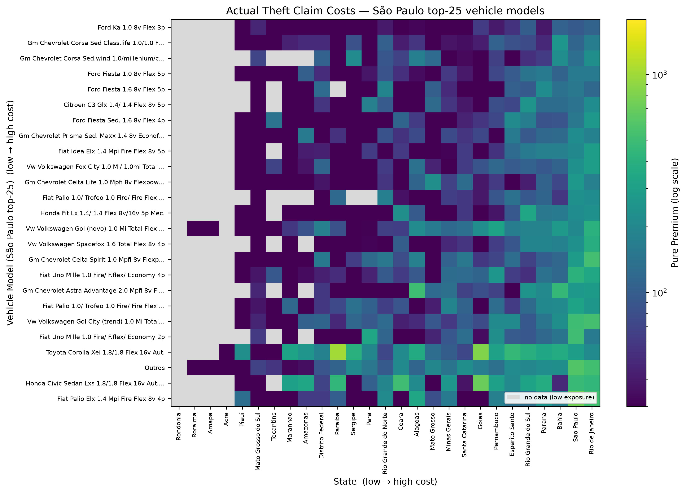
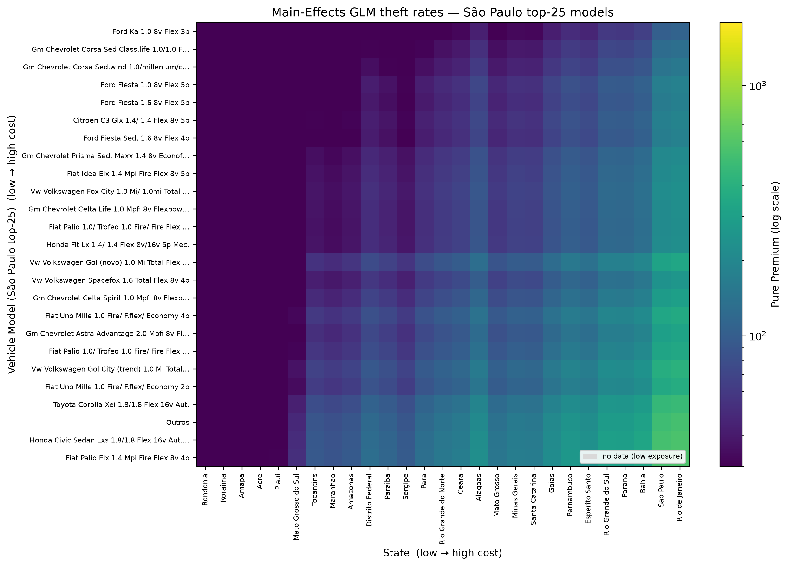
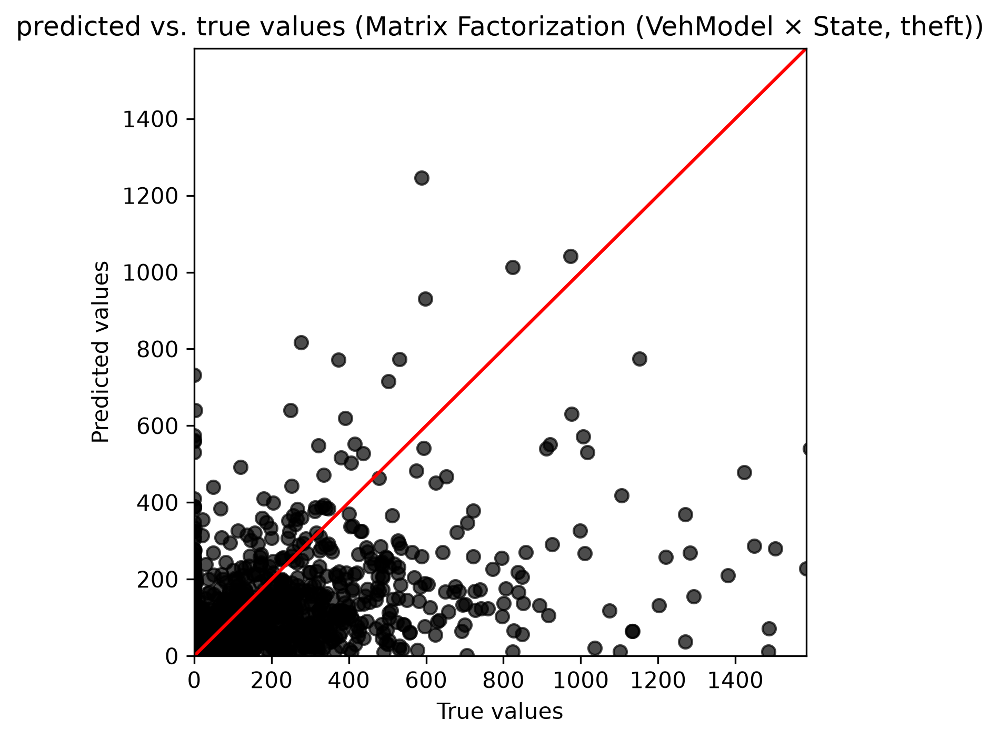
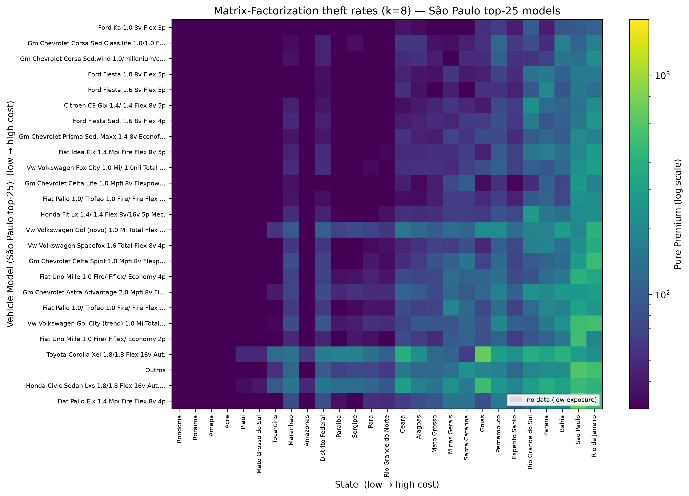

**クラス料率算定における高次元交互作用のモデリングのための行列分解 — 車両盗難への応用（車種×州）**

*著者： Nana Kato, Suguru Fujita, Shunichi Nomura*

提出先：

第33回 国際アクチュアリー会議（ICA2026）

2026年11月8日～13日

*本稿は第33回国際アクチュアリー会議のために作成されたものである。*

*日本アクチュアリー会（IAJ）および国際アクチュアリー会（IAA）は、本稿および付随資料に述べられた意見・内容について一切の責任を負わない。また、本稿に含まれる意見・内容はIAJおよびIAAの見解を反映するものではない。*

Nana Kato, Suguru Fujita, Shunichi Nomura

IAJおよびIAAは、本稿の全ての複製において著者を明示し、上記の著作権表示を含めることを保証する。

## 要旨（参考訳）

**主分野**：損害保険
**副分野**：データサイエンス／AI
**キーワード01**：行列分解（Matrix Factorization）
**キーワード02**：クラス料率算定（Class Rate-Making）
**キーワード03**：交互作用（Interaction）

本研究は、レコメンダーシステムで広く用いられる技術である行列分解（Matrix Factorization）を、保険のクラス料率算定への新しいアプローチとして導入する。我々は、地域や車種といったカテゴリ変数およびそれらの交互作用の高次元性を扱うという、アクチュアリー科学における重要な課題に取り組む。これらの変数はしばしば複雑な交互作用を示す一方で、現代の保険ポートフォリオは典型的にスパースな事故実績に悩まされる。従来の統計モデルがこのような高次元交互作用を扱うのに苦労してきたのに対し、我々の行列分解アプローチは潜在因子の積を通じてそれらを効率的に推定し、パラメータ数を大幅に削減する。さらに、我々のアプローチは交互作用の単純かつ直截的な表現を提供する。これは純保険料の設定における説明責任（アカウンタビリティ）に不可欠でありながら、他の機械学習手法ではしばしば見落とされてきた点である。その性能を実証するため、極めて高次元の変数を含む実世界の自動車保険データセットを用いた比較分析を、ここでは**車両盗難（robbery）ペリル**に適用して行った。盗難の純保険料率は、衝突事故に比べて車種×地域の交互作用が格段に強いという特徴を持つ。提案モデルは、安定した行列分解のためのR/Pythonライブラリであるcmfrecを用いて実装・最適化し、潜在因子の数と正則化の重みは交差検証によって決定した。次いで、アクチュアリー実務で一般的な標準的な一般化線形モデル（GLM）および一般化線形混合モデル（GLMM）との性能比較を行った。その結果、行列分解はこの交互作用を高ランクの分解によって捉え、非加重RMSEでは最も精度の高いモデルとなった。さらに重要な点として、本手法が本来対象とするスパースな露出セグメントにおいては、露出加重RMSEで主効果GLMを上回った一方、データの豊富な（密な）セグメント—プールした指標を支配する—ではGLMも依然として競争力を保った。本研究は、従来モデルが苦戦するまさにスパースかつ高交互作用の設定において、行列分解がアクチュアリーにとって強力な代替手段となることを検証するものである。

# 序論

保険料率の算定において、クラス料率の決定は、多数のカテゴリを含む変数や欠測データを扱う際にしばしば困難を伴う。例えば自動車保険のタリフでは、地理的地域や車両メーカーといった多数のカテゴリを持つ変数が頻繁に用いられ、これらと他の変数との交互作用がモデルに組み込まれることが多い。

　交互作用は、個々の変数だけでは説明できない効果を捉えるための重要なモデリング要素である。例えば、特定の車種の損害率が特定の地域で著しく高い（あるいは低い）といった、地域と車種の間の特有の関係が存在しうる。しかし、いずれも多数のカテゴリを持つ変数どうしの交互作用を考えると、可能な組合せの数は膨大になる。これは、データの不均衡による露出（エクスポージャ）不足のセグメントや、データが完全に欠測しているセグメントを生じさせ、モデリングの難しさをさらに高める。とりわけ本研究のように行軸を個別の車種（トリムレベル）まで細かくとると、この課題は一層先鋭化する。

　従来の一般化線形モデル（GLM）で交互作用項を導入することでこうした関係を考慮することは可能だが、カテゴリ数が増えるにつれて係数推定の精度が低下し、解釈可能性の問題が生じる。したがって、適切なモデリングのためには代替的アプローチの導入が必要となる。

広く用いられている代替手段の一つが一般化線形混合モデル（GLMM）であり、これは高カーディナリティの因子およびその交互作用に対して変量効果を導入することでGLMを拡張する（例：Hammad & Harby, 2016）。もう一つの重要な方向性は、高次元GLMに適用される正則化手法である（例：Takahashi & Nomura, 2023）。いずれのアプローチも、弱い、あるいは裏付けの乏しい交互作用項をゼロに縮小（シュリンク）することで、過学習を抑え安定性を高める。並行して、ニューラルネットワークなどの機械学習手法（例：Richman & Wüthrich, 2024）も、非線形性や交互作用を自動的に捉える能力から広く採用されてきた。

　一方で、レコメンダーシステムなどの分野では、行列分解（Matrix Factorization）はデータのスパース性や欠測に対する高いロバスト性で知られ、広く用いられている技術である。加えて、機械学習手法と比較して、行列分解は潜在因子をデータ内の背後にある構造や関係として理解できることが多いため、比較的高い解釈可能性を持つ。さらに、未観測の交互作用効果をゼロに縮小しがちな変量効果モデルや正則化手法とは異なり、行列分解はそのような交互作用を、強制的に消失させることなく潜在因子構造を通じて自然に補完（インピュート）できる。保険データはスパース性や欠測に関して類似の課題を共有しているにもかかわらず、こうした行列分解手法が保険料率算定に適用された事例は極めて少ない。

　本研究では、行列分解を用いた新しいクラス料率算定手法を提案する。具体的には、高次元カテゴリデータや欠測値が存在する環境でも適用可能なアプローチを探るために行列分解（MF）を用いる。本手法の有効性を実証するため、従来のクラス料率算定手法と比較し、その利点と課題を論じる。

　本稿の構成は以下のとおりである。第2節では従来のクラス料率算定手法を、特に交互作用に関する既存の課題に焦点を当てて概観する。第3節では行列分解技術の概要を示し、その保険料率算定への応用を論じる。第4節では、提案手法の有効性を示すために実データを用いた分析結果を提示する。最後に第5節で結論と今後の研究方向について述べる。

# クラス料率算定の既存手法

## 一般化線形モデル（GLM）

一般化線形モデル（GLM）は、クラス料率の算定に広く用いられてきた。GLMは、柔軟な誤差構造とリンク関数を許容することで線形回帰を一般化する。応答変数の期待値 E[Y] を、リンク関数 g(∙) を介して説明変数 Xi の線形結合に関連付けることで、モデルは次のように表される：

$$g\!\left(E[Y \mid X_1, X_2, \ldots, X_p]\right) = \beta_0 + \beta_1 X_1 + \beta_2 X_2 + \cdots + \beta_p X_p$$

- Y：応答変数（例：事故頻度、事故severity、損害率）

- g(∙)：リンク関数（例：恒等関数、対数関数、ロジット関数）

- β0, β1,⋯βp：回帰係数

- X1,⋯Xp：説明変数（例：年齢、性別、車種、地域、走行距離）

GLMは説明変数間の交互作用や非線形関係を組み込むことができる。例えば、年齢と走行距離の組合せは、各要因を単独で考えた場合とは異なる効果を持つ可能性がある。このような場合、交互作用項 $X_i X_j$ を説明変数として加えることでその関係を捉えられる：

$$g\!\left(E[Y \mid X_1, X_2, \ldots, X_p]\right) = \beta_0 + \sum_{i=1}^{p} \beta_i X_i + \sum_{i=1}^{p-1}\sum_{j=i+1}^{p} \beta_{ij} X_i X_j$$

ここで βij は Xi と Xj の交互作用に対する回帰係数を表す。さらに、応答変数が説明変数に対して非線形に増加する場合には、二次項 $X_i^2$ のような高次項を加えることもできる。

　しかし、変数が多数のカテゴリを持つ場合、これらの交互作用項はモデルの複雑さを著しく増大させ、解釈可能性と安定性の問題を引き起こす。例えば、数百から数千のカテゴリを持つ「車種」のようなカテゴリ変数を考えてみる。これと別のカテゴリ変数（例：地域）との交互作用を考えると、可能な組合せの数は膨大になる。そのようなすべての交互作用項を明示的にGLMに含めると、以下の問題が生じる：

モデルの複雑さ：説明変数の膨大な数によりモデルが極めて複雑になり、解釈可能性を損ない、計算コストを増大させる。

過学習：多数の交互作用項を加えることで、モデルが学習データに過適合し、未知データに対する予測性能が低下するリスクが高まる。

多重共線性：複数の変数が相互に関連していると多重共線性が生じ、係数推定が不安定で解釈が困難になる。

スパース性：特定のカテゴリ組合せのデータが乏しい、あるいは完全に欠測している場合、その交互作用項の係数を正確に推定することが困難になる。欠測値の処理は、単純な補完手法がバイアスを持ち込みうるため、慎重な検討を要する。

## 一般化線形混合モデル（GLMM）

GLMの限界、とりわけ高次元カテゴリ変数を扱う際の過剰パラメータ化と過学習の問題に対処するため、一般化線形混合モデル（GLMM）がしばしば検討される。GLMMは、従来の固定効果に加えて、高カーディナリティの因子およびその交互作用に対する変量効果を導入することで、標準的なGLMを拡張する。

数学的には、特定のカテゴリ水準に対応する変量効果を組み込むことで、モデルは個々の変数を列挙して次のように表される：

$$g\!\left(E[Y \mid X_1, \ldots, X_p, u_1, \ldots, u_q]\right) = \beta_0 + \sum_{i=1}^{p} \beta_i X_i + \sum_{l=1}^{q} u_l Z_l$$

ここで u1,u2,…,uq は共通の分布 $N(0, \delta^2)$ に従うと仮定される変量効果を表し、Z1,Z2,…,Zq は変量効果に対応するダミー変数である。クラス料率算定の文脈では、標準的な説明変数には固定効果 β1X1,β2X2,…,βpXp が用いられ、車種や地域のような高カーディナリティ因子およびその交互作用には変量効果 u1Z1,u2Z2,…,uqZq が導入されるのが典型的である。

変量効果を導入する主な利点は、それに内在する部分プーリング（partial pooling）の仕組みにある。特定のカテゴリ組合せのデータが乏しい、あるいは欠測している場合、GLMMはそれらの組合せの変量効果が共通の分布から抽出されると仮定する。この分布仮定は、弱い、あるいは裏付けの乏しい交互作用項を自然にゼロへ縮小し、過学習を抑え安定性を高める。

しかし、GLMMは正則化を通じてスパース性を扱うロバストな統計的枠組みを提供する一方で、未観測または裏付けの弱い交互作用効果はゼロに向かうと仮定する。それらは、欠測データを説明しうる背後の潜在構造を明らかにしようとはしない。第3節で導入する行列分解は、そのような交互作用を強制的に消失させることなく潜在因子構造を通じて自然に補完することで、この特定の限界に対処する。

# 行列分解を用いたクラス料率算定

## 行列分解

行列分解（MF）は、もともとレコメンダーシステムや自然言語処理の分野で開発された技術である。高次元データを低次元の潜在因子へ分解することで、MFはデータの背後にある構造を効率的に捉えることができる。

　本節では、レコメンダーシステムの文脈におけるMFの問題設定と推定手法を説明する。基本的な設定では、m人のユーザーのn個のアイテムに対する選好が、m×n次元の非負行列 X として観測される。しかし実際には、大規模行列 X の要素のうちごく一部しか観測されない。したがって X は、ほとんどの要素が欠測しているスパースな行列であるのが典型的である。レコメンダーシステムの目的は、X の構造を学習し、欠測値を適切に補完することにある。これにより、すべてのアイテムに対するユーザーの選好を予測して適切なアイテムを推薦できる。以下では、広く用いられる2つの技術、特異値分解（SVD）と非負値行列因子分解（NMF）を紹介する。

### 特異値分解（SVD）

SVDは、観測行列 X を次のように分解する手法である：

$$X \approx U \Sigma V^{\top}$$

この式において、U は左特異ベクトルからなる直交行列、Σ は特異値を含む対角行列、V は右特異ベクトルからなる直交行列である。レコメンダーシステムでは、Σ のランク（非ゼロの対角要素の数）を m や n よりはるかに小さい値に制限する。これにより、観測行列 X を低次元の潜在因子空間へ写像し、ユーザーの選好を学習できる。

　完全な行列に対してSVDを効率的に計算する標準的なアルゴリズムは存在するが、レコメンダーシステムに現れるスパース行列には直接適用できない。代わりに、勾配ベースの最適化や交互最小二乗法（ALS）を用いてパラメータを推定する。SVDの主な利点は、ノイズを除去しつつ次元削減できる点にある。しかし、観測行列 X が非負値のみを含む場合、SVDに基づく補完は負の値を生じうる。これを避けるため、以下の非負値行列因子分解がしばしばより効果的である。

### 非負値行列因子分解（NMF）

NMFは、非負の観測行列 X を次のように分解する技術である：

$$X \approx A B^{\top}$$

　この定式化において、A と B は少数の列を持つ非負行列であり、それぞれユーザーとアイテムの潜在因子を表す。レコメンダーシステムの文脈では、A はユーザーの特徴、B はアイテムの特徴を表し、その積がユーザーの選好の予測に用いられる。NMFの重要な特徴は、潜在因子行列 A と B が非負値に制約され、しばしば多くのゼロを含む点である。このゼロと非ゼロの明確な対比が、推定結果の解釈可能性を高める。

　非負行列 A と B は、通常、勾配ベースの最適化手法または交互最小二乗法（ALS）を用いて推定される。しかし、これらの手法は局所最適に収束しやすいため、適切な初期値を与えることが不可欠である。あるいは、次節で論じるように、正則化によって推定を安定化することもできる。

## 提案する行列分解モデル

行列分解の保険料率算定への応用に関する研究は、国際的な研究でも進展しつつある。損害保険の分野では、例えば Seo et al. (2022) がスパース非負値行列因子分解を用いて、攻撃的な運転挙動と運転リスクの関係を解釈可能な低ランク潜在リスク因子として抽出し、高リスクと低リスクの運転挙動を成功裏に区別した。Xie and Gan (2022) および Xie et al. (2025) は、ファジィクラスタリングを伴うスパース非負値行列因子分解を自動車保険の事故データに適用し、相対的な地域リスクの評価を行った。これらの研究は、行列分解が従来の統計手法と比べてより柔軟で高い解釈可能性を持つモデルを提供できることを示しており、アクチュアリー科学の分野における新しいアプローチとして期待されている。

　本研究では、行列分解を料率算定に直接適用するアプローチを提案する。前節で導入した非負値行列因子分解モデルをさらに精緻化した以下のモデルを用いる：

$$X \approx A B^{\top} + \mu\, \mathbf{1}_m \mathbf{1}_n^{\top} + b_A \mathbf{1}_n^{\top} + \mathbf{1}_m b_B^{\top}$$

これは Koren, Bell & Volinsky (2009) による*バイアス付き（biased）*行列分解モデルであり、全体平均と行／列のバイアス項が主効果を吸収することで、潜在因子の積 $AB^{\top}$ が残差である交互作用構造のみをモデル化する。ここで A はユーザーの潜在因子を表す m×k 行列、B はアイテムの潜在因子を表す n×k 行列、μ は全体平均、1m, 1n はそれぞれ m 次元・n 次元の全要素が1のベクトルである。さらに bA はユーザー固有のバイアスを表す m 次元ベクトル、bB はアイテム固有のバイアスを表す n 次元ベクトルである。上式で推定すべき変数は、A, B, bA, bB, μ の各要素である。これらは、非負制約の下での交互最小二乗法（ALS）に、L2正則化項（各要素の二乗和に基づくペナルティ項）を加えて推定される。パラメータ推定の最適化問題は次のように定式化される：

$$\min_{A,B,b_A,b_B,\mu}\; \left\lVert X - \left(A B^{\top} + \mu\, \mathbf{1}_m \mathbf{1}_n^{\top} + b_A \mathbf{1}_n^{\top} + \mathbf{1}_m b_B^{\top}\right) \right\rVert_F^2 + \lambda \left( \lVert A \rVert_F^2 + \lVert B \rVert_F^2 \right)$$

制約条件：A, B の要素はすべて非負

ここで $\lVert \cdot \rVert_F^2$ は二乗フロベニウスノルム、すなわち観測要素の二乗和である。加えて、交互作用項 $AB^{\top}$ のランクを決定する潜在因子行列 A, B の列数 k は、L2正則化項の重み λ とともに、候補値の中から交差検証によって選択される。

　本研究の目的はクラス料率算定への応用であるため、上記のモデルをレコメンダーシステムの文脈から料率算定の文脈へ**読み替えて**用いる。レコメンダーシステムでは行列 $X$ の行・列・各要素がそれぞれ「ユーザー」「アイテム」「評価値（選好）」を表すが、本研究ではこれらを次表のように対応させる。行に対応させるのは**個別の車種（VehModel）**である。

| レコメンダーシステム | 本研究（クラス料率算定への応用・車種×州版） |
|---|---|
| ユーザー（行, $m$ 個） | 車種（個別のトリムレベル車種、VehModel） |
| アイテム（列, $n$ 個） | 州（地域） |
| 評価値・選好（要素 $x_{ij}$） | 事故コスト（本研究では盗難のクレームコスト＝過去の実績純率, Σクレーム÷Σ露出） |
| ユーザー潜在因子 $A$ | 車種の潜在因子 |
| アイテム潜在因子 $B$ | 州の潜在因子 |
| ユーザーバイアス $b_A$ | 車種の主効果 |
| アイテムバイアス $b_B$ | 州の主効果 |
| 全体平均 $\mu$ | 全体の平均クレームコスト |
| 潜在因子の積 $AB^{\top}$ | 車種×州の交互作用 |

　この読み替えにより、本モデルが構築するものは次のように理解できる。全体平均 $\mu$ と車種・州それぞれの主効果（バイアス項 $b_A, b_B$）が各セル（車種×州の組合せ）の平均的なクレームコスト水準を表し、潜在因子の積 $AB^{\top}$ が、主効果の和では説明できない車種×州の交互作用を低ランク（$k$ 次元）で捉える。すなわち、観測行列 $X$ は事故コスト（本研究では盗難の過去のクレームコスト, historical pure premium rate）から構成され、行に車種、列に州（地域）を対応させる。

　第2節で述べたとおり、多数のカテゴリを持つリスク因子間の交互作用の推定は、特定のカテゴリ組合せにおける欠測データのために課題となる。この課題は、行を車種グループ（約436）から個別車種（約4,259）へと細かくすると格段に厳しくなる。しかし提案アプローチでは、交互作用は潜在因子行列の積を用いた低ランク行列によって表現される。その結果、欠測データを含む組合せに対しても、各因子の効果を考慮した適切な予測が期待できる。

# 応用

## 分析の概要

本節では、自動車保険の事故データを用い、特に行列分解技術を用いて**個別の車種**および州別の**車両盗難（robbery）の純保険料率**を推定する。本節の主眼は、極めて高次元でスパースな車種×州の観測行列のもとで、提案手法と従来手法の比較を行うことにある。

　盗難を分析対象に選んだのは、そのリスクが車種と地域の**交互作用**として現れることが先験的に強く予想され、交互作用を低ランク構造として推定する行列分解の実務的価値を示す好個の題材だからである。盗難は修理費のように車両単独で決まる（車種の主効果に近い）のではなく、車両の価値や転売市場にとっての魅力（誘因）と、地域の都市化・盗難車の転売／解体市場・検挙水準といった治安環境（機会）とが**重なる**セルで突出すると考えられ、これは主効果の和では捉えきれない交互作用そのものである。

　評価のベースラインを提供するため、まず2つの従来手法—交互作用項を持たない一般化線形モデル（GLM）と、交互作用を変量効果として扱う一般化線形混合モデル（GLMM）—の推定結果を提示する。続いて、比較対象として提案する行列分解アプローチによる推定結果を示す。これらの結果に基づき、保険業界におけるクラス別料率の決定に行列分解を適用することの実務的な有効性と利点を論じる。

## データセット

本分析では、ブラジルの自動車保険データからなるCASdatasetsライブラリの brvehins1 データセットを利用する。これらのデータはもともとAUTOSEG自動車保険統計システムから取得・加工されたものである。データセットは1,965,355件のレコードからなり、露出（エクスポージャ）、保険料、事故金額に関する詳細な情報を含む。利用可能な属性には、性別、年齢、車種グループ、**個別車種（VehModel）**、車両年式、地域、州が含まれる。

　本研究では、多数のカテゴリを持つリスク因子として、**個別の車種（VehModel）**と州に焦点を当てる。予測の目的変数は、**盗難（robbery）の過去のクレームコスト**（＝盗難クレーム総額 `ClaimAmountRob` ÷ 総露出）である。盗難専用の露出基盤には注意点がある。brvehins1 には火災・盗難担保専用の露出列 `ExposFireRob` が定義されているが、この列（および対になる保険料 `PremFireRob`）は**全データシャードでゼロのまま出荷されている**。したがって盗難専用の露出基盤は存在せず、本分析では全体露出 `ExposTotal` を分母に用いる。

　**元データ**における露出（エクスポージャ）の分布を、個別車種別（表4.1.1）および州別（表4.1.2）に示す。ここでの露出は全体露出 `ExposTotal` の合計であり、元データ全体（1,965,355レコード）にわたる。総露出は6,260,366、**個別車種は4,259**、州は27（ブラジルの27連邦単位）である。露出は両軸ともに強く偏っている。個別車種に分解すると露出は大きく分散し、構成比1%以上の車種は**わずか10車種**にとどまる。すなわち車種×州の行軸は極めて細粒度でスパースである。州の偏りも強く、São Paulo 単独で全体の約40%を占める。なお個別車種についても、元データの120,515レコード（露出264,376、全体の約4.2%）で車種コードが欠損しており、これらは表4.1.1の4,259車種には含めず「未分類（VehModel欠損）」として別掲した。

表4.1.1：元データにおける個別車種別のエクスポージャ量（フィルタ前、`ExposTotal` の合計。構成比は総露出6,260,366に対する比率、降順）。表を簡潔にするため、構成比1%未満の車種（4,249車種）は「その他」に集約した。「Outros」（ポルトガル語で「その他」）は元データ由来の集約ラベルである。

| 車種 | エクスポージャ量 | 構成比 |
|---|--:|--:|
| Outros | 321,277 | 5.13% |
| Vw - Volkswagen - Gol City (trend) 1.0 Mi Total Flex 8v 4p | 101,433 | 1.62% |
| Vw - Volkswagen - Gol (novo) 1.0 Mi Total Flex 8v 4p | 100,382 | 1.60% |
| Vw - Volkswagen - Fox City 1.0 Mi/ 1.0mi Total Flex 8v 4p | 86,866 | 1.39% |
| Fiat - Palio 1.0/ Trofeo 1.0 Fire/ Fire Flex 4p | 82,403 | 1.32% |
| Fiat - Uno Mille 1.0 Fire/ F.flex/ Economy 4p | 80,474 | 1.29% |
| Gm - Chevrolet - Corsa Sed Class.life 1.0/1.0 Flexpower | 79,600 | 1.27% |
| Ford - Fiesta 1.0 8v Flex 5p | 72,182 | 1.15% |
| Ford - Ka 1.0 8v Flex 3p | 71,486 | 1.14% |
| Gm - Chevrolet - Celta Life 1.0 Mpfi 8v Flexpower 3p | 66,602 | 1.06% |
| その他（4,249車種、各1%未満） | 4,933,283 | 78.80% |
| 未分類（VehModel欠損） | 264,376 | 4.22% |
| **合計** | **6,260,366** | **100.00%** |

表4.1.2：元データにおける州別のエクスポージャ量（フィルタ前、`ExposTotal` の合計。構成比は総露出6,260,366に対する比率、降順）。参考として州別の盗難クレームコスト・面積・人口・人口密度を併記した。

| 州 | エクスポージャ量 | 構成比 | 盗難クレームコスト | 面積（km²） | 人口（2022年国勢調査） | 人口密度（hab/km²） |
|---|--:|--:|--:|--:|--:|--:|
| Sao Paulo | 2,516,721 | 40.20% | 314 | 248,223 | 44,411,238 | 178.92 |
| Minas Gerais | 549,146 | 8.77% | 124 | 586,522 | 20,539,989 | 35.02 |
| Rio de Janeiro | 545,110 | 8.71% | 330 | 43,780 | 16,055,174 | 366.72 |
| Parana | 461,825 | 7.38% | 204 | 199,308 | 11,444,380 | 57.42 |
| Rio Grande do Sul | 456,299 | 7.29% | 184 | 281,730 | 10,882,965 | 38.63 |
| Santa Catarina | 319,286 | 5.10% | 126 | 95,736 | 7,610,361 | 79.49 |
| Bahia | 218,011 | 3.48% | 233 | 564,733 | 14,141,626 | 25.04 |
| Distrito Federal | 181,900 | 2.91% | 101 | 5,780 | 2,817,381 | 487.44 |
| Goias | 181,272 | 2.90% | 191 | 340,112 | 7,056,495 | 20.75 |
| Pernambuco | 157,863 | 2.52% | 174 | 98,148 | 9,058,931 | 92.30 |
| Ceara | 105,807 | 1.69% | 138 | 148,921 | 8,794,957 | 59.06 |
| Esperito Santo | 95,828 | 1.53% | 165 | 46,096 | 3,833,712 | 83.17 |
| Mato Grosso | 69,155 | 1.10% | 128 | 903,366 | 3,658,649 | 4.05 |
| Mato Grosso do Sul | 60,444 | 0.97% | 55 | 357,146 | 2,757,013 | 7.72 |
| Para | 53,046 | 0.85% | 120 | 1,247,955 | 8,120,131 | 6.51 |
| Rio Grande do Norte | 52,742 | 0.84% | 105 | 52,811 | 3,302,729 | 62.54 |
| Paraiba | 46,149 | 0.74% | 88 | 56,470 | 3,974,687 | 70.39 |
| Alagoas | 41,279 | 0.66% | 185 | 27,779 | 3,127,683 | 112.59 |
| Sergipe | 34,509 | 0.55% | 79 | 21,915 | 2,210,004 | 100.84 |
| Maranhao | 33,471 | 0.53% | 89 | 331,937 | 6,776,699 | 20.42 |
| Piaui | 24,199 | 0.39% | 31 | 251,578 | 3,271,199 | 13.00 |
| Amazonas | 23,649 | 0.38% | 85 | 1,559,159 | 3,941,613 | 2.53 |
| Tocantins | 18,226 | 0.29% | 93 | 277,721 | 1,511,460 | 5.44 |
| Acre | 5,432 | 0.09% | 54 | 164,123 | 830,018 | 5.06 |
| Amapa | 3,626 | 0.06% | 26 | 142,829 | 733,759 | 5.14 |
| Roraima | 2,945 | 0.05% | 31 | 224,301 | 636,707 | 2.84 |
| Rondonia | 2,420 | 0.04% | 56 | 237,591 | 1,581,196 | 6.66 |
| **合計** | **6,260,366** | **100.00%** | **234** | **8,515,770** | **203,080,756** | **23.85** |

注：**盗難クレームコスト**は元データ全レコードでの露出加重値（Σ`ClaimAmountRob`／Σ`ExposTotal`）である。**面積・人口**はIBGE 2022年国勢調査（面積は連邦単位の公式値、人口は2022年国勢調査人口）。**人口密度**は本表の人口÷面積で算出した（hab/km²）。

　分析にあたり、契約量が少ない場合には過去データからクレームコストを統計的に決定するのが難しいため、総露出が100未満のセル（車種×州の組合せ）は欠測に変換した。さらに、総露出が10に満たない車種はモデル構築から除外した。この結果、学習用の行列は**1,277車種 × 27州、観測セル数6,600（全体の約19.1%が観測）**となった。すなわち観測率は約19%と低く、**本行列は顕著にスパースである**。加えて観測セルの約25%は盗難クレームがゼロ（純率ゼロ）であり、目的変数のゼロ過剰性も強い。観測されなかった組合せは、提案する行列分解アプローチによって推定される欠測値として扱う。

　個別車種は4,259種にのぼるため、全4,259行（フィルタ後1,277行）を並べたヒートマップは判読不能である。そこで本研究では、**São Paulo（露出全体の約40%を占める最大の州）で露出上位の車種**に表示を限定し、行を判読可能な範囲に絞ったヒートマップを図に用いる。図4.2.1・図4.3.1・図4.5.2 はいずれも「São Paulo 露出上位25車種（行）× 27州（列）」の同一部分行列を表示する。全ヒートマップは共通のカラースケール・行／列順序を用い、右に歪んだクレームコストの分布を暗部に潰さず広げるため対数スケールで描画する。欠測セルはグレーで示す。なお、モデルの学習・評価は絞り込み前の全1,277車種×27州行列に対して行っており、図の車種限定はあくまで**可視化のため**である。

図4.2.1：個別車種（São Paulo 露出上位25車種）および州別の実際の盗難クレームコスト。行・列とも露出加重の周辺コストで低→高に並べ替えてある。グレーは低露出のため欠測のセル。

　図4.2.1から、盗難クレームコストが車種（行）と州（列）の**両方**の方向に大きく変動していることが読み取れる。州方向の地理的勾配は明瞭で、盗難コストは南東部・沿岸大都市（右端の Rio de Janeiro、São Paulo）で最も高く、北部・フロンティア州（左端の Rondônia、Roraima、Amapá）で最も低い。左側の低露出州では観測セルがまばらでグレーが多い。車種方向では、個別車種まで分解したことで大きな開きが現れ、露出100以上のセルに限っても車種別の盗難クレームコストは0から約7,100に及ぶ。図の下部に並ぶ高価格帯の車種（Toyota Corolla、Honda Civic といったセダン）は、上部の小型大衆車（Ford Ka、各種 1.0L ハッチバック）より明確に高い盗難コストの行を示しており、車両価値と盗難者にとっての魅力を反映した順序と考えられる。

　しかし、車種と州それぞれの主効果（行・列の平均的な高低）だけでは、図4.2.1のヒートマップは説明しきれない。ある車種の盗難コストの高低は州によって変わり、逆にある州のなかでも車種ごとの高低の並びは一様ではない。この「行と列の組合せ（セル）に固有の上振れ・下振れ」こそが車種×州の**交互作用**であり、主効果の単純な和では捉えられないものと考えられる。ただし本研究では観測セルが疎で（多くの車種は数州でしか観測されない）、この交互作用シグナルはノイズを多く含む点に注意が必要である。

## 交互作用項を持たないGLM

アクチュアリー実務では、膨大な数のカテゴリ組合せに対して交互作用項を明示的に定義することは、技術的に困難で計算的にも複雑とみなされることが多い。そのため、交互作用項を持たない一般化線形モデル（GLM）が実務的なベースラインとして一般的に用いられる。まずこの基本的なアプローチをデータセットに適用する。この主効果のみの定式化は意図的に最も単純なベースラインである点を強調しておく。より強力なGLMベンチマークは正則化された交互作用項—例えば Takahashi & Nomura (2023) のグループ融合ラッソ（group fused lasso）—を組み込むものであり、これは今後の課題とする。

　前述のとおり、モデルは以下のように定義される。車種 i、州 j の総事故金額を Yij、対応する露出を Eij とする。純保険料（率）は非負・裾の重い、ゼロに確率質量を持つ応答であるため、標準的なアクチュアリー分布族である Tweedie（複合ポアソン–ガンマ、1 < p < 2）を対数リンクで用い、露出を事前重み（prior weight）として率を直接モデル化する：

$$\mathrm{PP}_{ij} \sim \mathrm{Tweedie}(p=1.5),\qquad \ln E[\mathrm{PP}_{ij}] = \beta_0 + \alpha_i + \tau_j$$

ここで：

- E[PPij] は期待純保険料率（盗難クレームコスト）。

- β0 は切片。

- αi と τj はそれぞれ車種と州の主効果を表す。この定式化は車種と州の間に交互作用がないことを仮定している点に注意されたい。モデルはデータが存在する観測セルのみを用い、露出を重みとして当てはめる。

　個別車種および州別の純保険料率の推定結果を図4.3.1に示す。主効果GLMは、観測データに現れた車種・州の水準をすべて含むセルを埋められる。

図4.3.1：主効果GLMによる盗難純保険料率の予測ヒートマップ（São Paulo 露出上位25車種）。交互作用項なしのGLM。図4.2.1と同一の行・列順序で表示している。

推定結果の特徴を以下にまとめる：

- 単純さと交互作用モデリングの限界：このアプローチは直截的で解釈が容易な一方、交互作用効果を考慮できない。その結果、ヒートマップは車種と州にわたって比例的な色の変化（行方向・列方向それぞれに滑らかなグラデーション）を示し、図4.2.1に見られるセル固有の濃淡（交互作用）を再現できない。

- 欠測値への外挿：観測データに現れた車種・州の水準に一律の係数を適用することで、欠測データのセルについても料率を計算できる。しかし、それは観測された主効果に基づく外挿にすぎず、当該セル固有の交互作用を反映するものではない。

## 交互作用を変量効果とするGLMM

一般化線形混合モデル（GLMM）はGLMの拡張であり、固定効果と変量効果の両方を含めることを可能にする。これは相関データやクラスタ化データのモデリングに特に有用である。本節では、主効果GLM（第4.3節）の変数を固定効果として扱い、車種と州の交互作用を変量効果として組み込むことで交互作用効果を考慮するモデルを検討する。

モデルは以下のように定式化される：

$$Y_{ij} \sim \mathrm{Poisson}(\lambda_{ij} E_{ij})$$

$$\ln E[Y_{ij}] = \ln E_{ij} + \beta_0 + \alpha_i + \tau_j + z_{ij}$$

ここで zij~$N(0, \delta^2)$ は車種 i と州 j の交互作用に対する変量効果を表す。式中の他の変数の定義は第4.3節で述べたものと同じである。

　GLMMは観測セル上では交互作用を部分プーリングにより推定できるが、本研究のように行を個別車種まで細かくとると各セルの露出は薄くなり、変量効果の識別は困難になる。決定的なことに、変量効果 $z_{ij}$ は交互作用が観測された箇所でしか推定できず、未観測の組合せではGLMMの予測は依然として主効果に回帰する。本研究の保留（テスト）セルはいずれも学習時に観測されなかった車種×州の交互作用水準であるため、GLMMのホールドアウト予測は主効果GLMのそれと一致する。この構造的限界は、行を個別車種まで細かくとり当てはまるセルの割合が下がるほど強く効く。

推定結果の特徴を以下にまとめる：

- 観測データに対する交互作用モデリング：非欠測セルについては、GLMMは交互作用効果を組み込み、特定の局所的変動を捉えることで主効果GLMよりも精緻な推定を可能にする。

- 欠測値に関する限界：このアプローチの主な課題は、変量効果 zij が観測された組合せに対してのみ推定可能である点にある。露出がゼロのセル（欠測データ）については、モデルは交互作用を予測する経験的根拠を欠き、推定は主効果に回帰（revert）してしまう。車種を細粒度化するとこの限界に該当するセルの割合が増える。

- 総合的な有効性：その結果、GLMMアプローチは高スパース性を特徴とするデータセットに対しては特に有効とは言えない。交互作用効果が最も必要とされる多数の欠測カテゴリ組合せに対して信頼できる予測力を提供できないためである。

## 行列分解（MF）

本節では、cmfrecライブラリ（Cortes, 2018。本稿で報告する分析はそのPython実装を用いる）を用いて提案する行列分解アプローチを適用する。このライブラリはRとPythonの両方で利用可能な行列分解の標準的なツールである。勾配ベースの手法や交互最小二乗法（ALS）を含む様々な最適化アルゴリズムを実装し、L1およびL2正則化の両方をサポートする。加えて、劣悪な局所最適への収束を避けるために著者が設計した特定の初期化戦略を組み込んでいる。モデルは3.2節で定式化したとおりである。

　モデルの実装に関しては、最適化に交互最小二乗法（ALS）を、正則化にL2正則化を用いる。いずれもライブラリ内のデフォルト設定である。推定される因子が料率算定に有効な範囲に収まるよう、nonneg パラメータを TRUE に設定して厳密な非負制約を課す。さらに、center パラメータを FALSE に設定して平均中心化（mean-centering）を回避し、非負観測行列の元のスケールと整合性を維持する。損失は露出で加重し、GLM/GLMMが offset/prior-weight を通じて適用する露出加重と整合させる。なお、非負制約は潜在因子行列 A と B には適用されるが、バイアス項 μ, bA, bB には適用されない。したがって当てはめ値は厳密には非負であることが保証されず、実務上必要な場合には予測料率をゼロで下限打ち切り（floor）すべきである。

- 交差検証によるハイパーパラメータ最適化

潜在因子数 k（候補：2〜27の整数）と正則化の重み λ（候補：0.01, 0.1, 1, 10, 20, 30, 50, 100, 1000）は、これらの候補からなるグリッド上での4分割交差検証によって選択し、平均の露出加重RMSE（Root Mean Square Error）を最小化する組合せを選んだ。k の探索上限を27としたのは、ランクが行列の小さい方の次元（27州）で頭打ちになるためである。テストセットはこのチューニングの前に取り分けてあり、ハイパーパラメータ選択が評価セルを見ることはない。**本研究（車種×州, 盗難）では、この手続きは k=8、正則化の重み λ=1000（探索グリッドの上限）を選んだ。** ここで重要なのは、λ=1000 が探索範囲の最大値であり、かつCV上の RMSE は λ=1000 においてほぼすべての k で近い値（約410〜411）を取った点である。すなわち交差検証は、豊かな高ランク交互作用よりも**強い正則化（交互作用の縮約）**を選好しており、選ばれた k=8 は限界的な選択である。これは、車種×州の交互作用シグナルが（観測セルが疎なため）弱く、モデルがそれを信頼度加重（credibility）的に強く縮小した結果と解釈するのが自然である。

- モデルの学習と検証

予測性能を評価するため、データの25%をテストセットとして確保し、残り75%をモデル構築に用いるホールドアウト検証を実施した。学習時に見られなかった車種または州を含むテストセルは、GLM/GLMMが定義できないため評価から除外し、3手法を同一の1,502セット上で採点した。適合度はテストデータに対して計算したRMSE・露出加重RMSEで評価した。図4.5.1は純保険料率の予測値対真値（行列分解）を示しており、実際のクレームコストとモデル予測との相関を可視化している。

- 全カテゴリの純保険料率の推定

最終推定では、全データセットを入力としてモデルを再学習した。これにより、当初は低露出のため欠測として扱っていたセルを含め、すべての車種×州の組合せについて純保険料率を推定できた。全カテゴリの結果（São Paulo 露出上位25車種の部分）ヒートマップを図4.5.2に示す。

図4.5.1：盗難純保険料率の予測値対真値（行列分解、ホールドアウトの全評価セル）

図4.5.2：個別車種（São Paulo 露出上位25車種）および州別の推定盗難純保険料率（行列分解, k=8）。図4.2.1・図4.3.1と同一の行・列順序で表示している。

推定結果の特徴を以下にまとめる：

- 欠測カテゴリに対するロバストな推定：未観測セルに苦戦するGLMMとは異なり、行列分解アプローチは行列全体について純保険料率を成功裏に推定する。図4.2.1でグレーだった低露出セル（特に左側の北部州）も、車種と州の背後にある潜在因子に基づいて妥当な値に補完されている。これは3手法の中で行列分解のみが持つ性質である。

- 交互作用の捕捉と縮約のバランス：結果として得られるヒートマップ（図4.5.2）は、主効果GLM（図4.3.1）の厳密に比例的な変化とは異なり、行ごと・セルごとの非一様なパターンを示す。ただし λ=1000 の強い正則化により、そのパターンは鮮明ではなく、主効果に近い滑らかな面に控えめな交互作用が重なった様相を呈する。これは前述のとおり、疎な車種×州行列における交互作用シグナルが弱く、モデルがそれを強く縮約したことと整合的である。

- 予測の信頼性：図4.5.1はホールドアウトセットにおける予測値と真値の正の相関を示しており、モデルが単に学習データに過適合しているわけではないことを示している。次節の直接比較（head-to-head）が示すとおり、本研究では観測セルにおいて行列分解が非加重RMSE・露出加重RMSEの**両指標**で主効果GLMを上回った。ただしこの優位はあくまで単一分割（seed 123）に基づくものであり、頑健性には留保が必要である。

## 予測性能の比較

前節までは各モデルの推定を個別に提示した。これらを対等な土俵で比較するため、主効果GLM、GLMM、および行列分解を、観測セルの同一のホールドアウトセット（1,502セル）上で評価した。公正な比較のためには2つの調整が不可欠である。第一に、行列分解の損失を露出で加重し、GLMとGLMMが露出加重（Tweedie の prior weight／Poisson の offset）として適用する露出加重と整合させる。第二に、純保険料のRMSEに加えて、露出加重RMSEを報告し、比較可能で露出を考慮した基準でモデルを判断する。

表4.5.1：観測セルの同一1,502セット上でのホールドアウト予測性能（低いほど良い、seed 123）。行列分解は交差検証で $k=8$, $\lambda=1000$ を選択した。

| モデル | RMSE | 露出加重RMSE |
|---|---:|---:|
| GLM（主効果） | 319.41 | 218.68 |
| GLMM（変量交互作用）† | 319.41 | 218.68 |
| 行列分解‡ | **281.43** | **191.91** |

† ホールドアウトの各セルは*未観測*の車種×州の交互作用水準である。したがってGLMMの交互作用変量効果 $z_{ij}$ は推定の根拠となるデータを持たずゼロに回帰するため、GLMMのホールドアウト予測は主効果GLMのそれと一致し、同じ誤差に到達する。これは当てはめのアーティファクトではなく、第4.4節で述べたGLMMの限界の具体的な数値的表現である。

‡ 行列分解の損失は（加重）二乗誤差であるのに対し、GLMとGLMMはそれぞれ Tweedie/Poisson 尤度を最適化する。したがってMFは、露出加重RMSEの列において、それ自身が最小化していない基準で採点されているにもかかわらず、両指標でGLMを上回った。

　プールした結果は、**単一分割（seed 123）においては一貫して行列分解に有利**である。行列分解は非加重RMSE（281.4 対 GLMの319.4）と露出加重RMSE（191.9 対 218.7）のいずれでも主効果GLMを下回った。GLMMは（各ホールドアウトセルが未観測交互作用で変量効果がゼロに回帰するため）GLMと完全に同点となる。ただしこの優位はあくまで単一分割に基づくものであり、下記の層別および追加検証とあわせて慎重に解釈する必要がある。

　露出の中央値でホールドアウトセルを層別した結果（表4.5.2）でも、**スパース層・密層の両方で行列分解がGLMを上回った**。

表4.5.2：露出で層別したホールドアウト性能（中央値で分割、各層 n=751、低いほど良い、seed 123）。

| 層 | モデル | 露出加重RMSE |
|---|---|---:|
| スパース（露出 < 中央値） | GLM / GLMM† | 329.95 |
| スパース（露出 < 中央値） | 行列分解 | **322.76** |
| 密（露出 ≥ 中央値） | GLM / GLMM† | 202.95 |
| 密（露出 ≥ 中央値） | 行列分解 | **171.80** |

　この層別は、行列分解の優位が特定の露出帯に偏っていないことを示す。とりわけスパース層では行列分解の露出加重RMSEがGLMを下回り（322.76 対 329.95）、露出の薄いセルでの当てはめが改善している。ただし、λ=1000 という強い正則化のもとでMFが達成したこの改善は、「豊かな高次元交互作用の捕捉」というより、**疎で不安定なセル推定を主効果へ向けて信頼度加重的に縮約したこと**による面が大きいと解釈するのが自然である（第4.5節参照）。この解釈は、λ が探索グリッドの上限に張り付き、CVが k にほぼ無反応であった事実と整合する。

### 追加検証①：観測セル（学習内）とホールドアウト（学習外）の対比

前掲のホールドアウト表（表4.5.1）でGLMMがGLMと完全一致するのは、テストセルがすべて未観測の車種×州交互作用だからである（脚注†）。では観測セルそのものへの当てはめ（学習内・apparent fit）ではどうか。ここではGLMMを、主効果GLMと**同一のTweedie当てはめ**の上に、車種×州交互作用を変量効果として加えた形で構成する（変量効果はTweedieの分散関数に基づく露出加重クレディビリティ＝変量切片の線形版。Python には既製の Tweedie 混合モデルが無いため、GLMとGLMMの主効果を完全に共有させ、差を交互作用のみに限定できるこの形を用いた）。表4.5.3に、観測6,600セルへ当てはめて同じ6,600セルで採点した結果を、ホールドアウトと並べて示す。

表4.5.3：観測セルへの当てはめ（学習内、6,600セル）とホールドアウト（学習外、1,502セル）の対比（低いほど良い、相関は高いほど良い、seed 123）。

| 評価 | モデル | 非加重RMSE | 露出加重RMSE | 相関 |
|---|---|---:|---:|---:|
| 学習内（観測6,600セル） | GLM ＝ GLMM | 222.64 | 144.24 | 0.837 |
| 学習内（観測6,600セル） | 行列分解 | 166.33 | **81.46** | 0.932 |
| 学習外（ホールドアウト1,502セル） | GLM ＝ GLMM | 319.41 | 218.68 | — |
| 学習外（ホールドアウト1,502セル） | 行列分解 | 281.43 | **191.91** | — |

決定的な点は、**GLMMを主効果GLMと同じTweedie族に揃えると、車種×州交互作用の分散が推定上ゼロ（τ²=0）となり、GLMMが学習内でもGLMと一致する**ことである。Tweedie分散パラメータは φ≈5,060 と大きく、各セルの主効果からの乖離（残差二乗）の平均（約4.96×10⁴）はTweedieの過程分散の平均（約1.10×10⁵）を下回り、残差が過程ノイズを超えるセルはわずか約16%にとどまる。すなわち重裾でゼロ過剰の盗難純率では、セルごとの上振れ・下振れは過程ノイズの範囲内にあり、識別可能な交互作用シグナルが取り出せない。したがって変量効果はゼロへ縮約し、GLMMはGLMに帰着する。これは脚注†の「未観測セルでの回帰」よりも強い主張であり、**観測セル上でさえ、正しい損失族のもとでは追加すべき安定な交互作用が存在しない**ことを意味する。

一方、行列分解だけは学習内で主効果を離れる（露出加重RMSE 81.46 対 144.24）。ただしこの学習内の当てはめは潜在因子がセル固有の変動を吸収するため楽観的であり（同じ優位はホールドアウトでは191.91 対 218.68 に縮む）、その改善はGLMMが検出しなかった交互作用の「回復」ではなく、λ=1000 の強い正則化のもとで低ランク構造へ縮約したこと（信頼度加重的縮約）に由来すると読むべきである。

### 追加検証②：レコード単位分割という別の評価設計

表4.5.1のセル単位ホールドアウトは、テストセルを丸ごと退避するためGLMMの交互作用が定義上ゼロに回帰する。この一致が評価設計に起因するものでないことを確かめるため、**評価設計を変えた別の検証**を行う。すなわち、セル単位ではなく**契約レコードを75/25に分割**し（seed 123）、各セル内のレコードを学習側・テスト側の双方に含める。こうすると同一の車種×州セルが学習・テストの両方に現れ、GLMMの交互作用変量効果は学習側レコードから推定可能になる（本設定では6,600セルすべてが両側で共有された）。

表4.5.4：レコード単位分割でのテスト側予測性能（6,600テストセル、seed 123、低いほど良い）。

| モデル | 非加重RMSE | 露出加重RMSE | 相関 |
|---|--:|--:|--:|
| GLM ＝ GLMM | 857.47 | 342.80 | 0.300 |
| 行列分解 | **855.13** | **334.89** | 0.295 |

この設計では交互作用が推定可能であるにもかかわらず、**Tweedie GLMMの交互作用分散は再びτ²=0と推定され、GLMMはGLMと一致した**。すなわち「テストセルが未観測だからGLMM=GLM」なのではなく、**セルが観測されていてもなお、Tweedie族のもとでは識別可能な交互作用が存在しない**ために両者が一致する。行列分解は露出加重RMSEでわずかにGLMを下回る（334.89 対 342.80）ものの差は小さく、相関はいずれも約0.30と低い。なお本設計の誤差水準がセル単位ホールドアウト（表4.5.1）より大きいのは、各テストセルの純率が当該セルの約25%のレコードのみから作られ標本誤差が大きいためであり、水準そのものは表4.5.1と直接比較できない（各設計内でのモデル間順位を読むべきである）。

以上2つの追加検証は、本研究の中心的観察—**車種×州の盗難交互作用は、正しい損失族のもとでは、観測セル上でも、またレコード単位で推定可能にしても、安定には識別できず、GLMMはGLMに帰着する**—を補強する。行列分解が示すわずかな改善も、交互作用の回復ではなく強い正則化による縮約に由来すると解釈するのが整合的である。

**限界。** 本研究の結果には、以下の留意点がある。第一に、*属性構成の交絡*。セル目的変数（生の盗難クレームコスト = Σクレーム/Σ露出）は、車種×州の交互作用に加えて各セルの契約者属性構成（性別・運転者年齢・車両年式のミックス）を混在させており、レコード単位の属性標準化は本分析では実施していない。第二に、*露出基盤*。brvehins1 には盗難専用の露出が存在せず、`ExposTotal` を代用の分母としている。第三に、**車種細粒度に固有の不安定性**。行を個別車種まで細かくすると各セルの露出が薄くなり、観測セルの生の純率自体が大きな標本誤差を含む。したがって観測セル上の精度数値は、真の車種×地域交互作用の推定精度というより、疎なセルにおける縮約推定量どうしの比較として読むべきである。

# 結論と今後の課題

本研究では、極めて高次元でスパースな**車種（個別車種）×州**の観測行列のもとで、車両盗難ペリルに対する純保険料率を推定し、行列分解（MF）と従来手法（主効果GLM・GLMM）の予測性能を比較した。行軸を個別の車種（トリムレベル約4,259車種、フィルタ後1,277車種）まで細粒度にとることで、観測率約19%・観測セルの約25%が盗難クレームゼロという、主効果モデルには不利で行列分解が本来対象とするスパースかつ高交互作用の設定を扱った。

第一に、車種×州行列は顕著にスパースであり（観測率約19%）、観測セルの約25%が盗難クレームゼロというゼロ過剰性も強い。行列分解が非加重RMSE・露出加重RMSEの**両指標**で主効果GLMを上回り、露出で層別したスパース層・密層の**両方**でも上回った。総じて本研究は、車種×州のように疎で高次元な交互作用構造をもつ設定において、行列分解が主効果GLM・GLMMに対して精度上の優位を示しうることを確認した。また、MFを用いると、未観察のセルについても補完が可能という実務的利点がある。行列分解はスパースで高交互作用の設定を有効に行う手法として検討の余地がある。

　本研究から示唆される今後の課題は以下のとおりである：

- サイド情報の統合（CMF）：個別車種はメーカー・車種グループ・車両価格帯といった観測可能な属性を豊富に持つ。これらを集合行列分解（Collective Matrix Factorization, CMF）で主行列と同時に分解すれば、露出の薄い車種が同一メーカー・同一グループから強度を借りて（borrow strength）推定を安定化できる可能性がある。車種細粒度でスパース性が強い本研究の設定は、CMFの価値を示す好個の題材である。

- 多様なデータセットでの検証：本研究はブラジルの自動車保険データを用いた。今回の結論を優位を確定的な結論とするには、より多くの分割シード・複数年次データ・マスクセル復元テストによる検証が必要である。また、他地域・他保険種目での検証も、知見の一般化には不可欠である。

# 参考文献

**Cortes, D. (2018).** Cofactor and Collective Matrix Factorization models (cmfrec): a Python/R package for matrix factorization with side information. Software library. https://github.com/david-cortes/cmfrec

**Dutang, C., & Charpentier, A. (2020).** *CASdatasets: A Collection of Actuarial Datasets*. R package version 1.0-11.

**Hammad, M. S., & Harby, G. A. (2016).** Using Multilevel Modeling for Group Health Insurance Ratemaking. *Predictive Modeling Applications in Actuarial Science: Volume 2, Case Studies in Insurance,* 126.

**Jørgensen, B., & Paes de Souza, M. C. (1994).** Fitting Tweedie's compound Poisson model to insurance claims data. *Scandinavian Actuarial Journal*, 1994(1), 69–93.

**Koren, Y., Bell, R., & Volinsky, C. (2009).** Matrix factorization techniques for recommender systems. *Computer*, 42(8), 30–37.

**Ohlsson, E., & Johansson, B. (2010).** *Non-Life Insurance Pricing with Generalized Linear Models*. Springer.

**Richman, R., & Wüthrich, M. V. (2024).** High-cardinality categorical covariates in network regressions. *Japanese Journal of Statistics and Data Science*, 7(2), 921–965.

**Seo, H., Shin, J., Kim, K. H., Lim, C., & Bae, J. (2022).** Driving risk assessment using non-negative matrix factorization with driving behavior records. *IEEE Transactions on Intelligent Transportation Systems*, *23*(11), 20398–20412.

**Takahashi, A., & Nomura, S. (2023).** Automatic segmentation of insurance rating classes under ordinal constraints via group fused lasso. *Asia-Pacific Journal of Risk and Insurance*, 17(1), 113–142.

**Xie, S., & Gan, C. (2022).** Fuzzy clustering and non-negative sparse matrix approximation on estimating territory risk relativities. In *2022 IEEE International Conference on Fuzzy Systems (FUZZ-IEEE)* (pp. 1–8). IEEE.

**Xie, S., Gan, C., & Lawniczak, A. T. (2025).** Non-negative Sparse Matrix Factorization for Soft Clustering of Territory Risk Analysis. *Annals of Data Science*, *12*(1), 307–340.

---

**日本アクチュアリー会（The Institute of Actuaries of Japan）**

〒104-6002 東京都中央区晴海1-8-10 晴海アイランド トリトンスクエア オフィスタワーX 2F

**e** secretariat@actuaries.jp　**w** www.actuaries.jp
